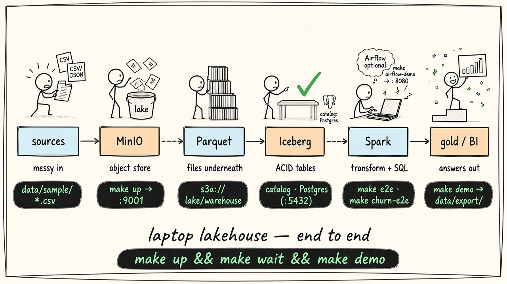
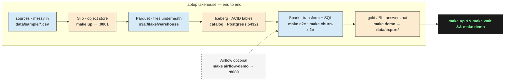

# local-data-lakehouse

Open-source **data lakehouse on your laptop** — Silo (S3-compatible object store), PostgreSQL (Iceberg JDBC catalog), Apache Spark 3.5, and Apache Iceberg.

This repository is the **hands-on companion** to the article *Stop Reading About Lakehouses. Build One Locally.* It contains Compose, jobs, sample data, and verified end-to-end demos only (no article prose).

| Component | Role |
|---|---|
| **Silo** | S3-compatible object store (MinIO lineage; [why we left MinIO](docs/object-store.md)) |
| **PostgreSQL** | Iceberg JDBC catalog |
| **Apache Spark 3.5** | Ingest, transform, query |
| **Apache Iceberg** | ACID tables, snapshots, time travel |

> **Why Silo (not MinIO)?** The MinIO community GitHub is archived (maintenance mode). This repo uses **SILO** (`pgsty/silo`) — a drop-in MinIO-compatible fork that keeps `MINIO_*` env names, disk format, and S3A/Iceberg paths working. Garage and RustFS were considered but not chosen for this teaching stack (partial S3 vs still-maturing Spark 3.5 path). Details: [docs/object-store.md](docs/object-store.md) · [silo.pgsty.com](https://silo.pgsty.com) · [github.com/pgsty/silo](https://github.com/pgsty/silo) · optional background: [maholick.com — MinIO is dead](https://maholick.com/blog/minio-is-dead-the-end-of-an-era-in-open-source-object-storage).

**Two runnable paths**

1. **Retail** — bronze → silver → gold metrics + Iceberg time travel  
2. **Churn features** — AI-platform usage / tickets / payments → `gold.churn_user_features` → CSV + JSON export  

## Architecture

End-to-end path on your laptop — doodle map with commands highlighted on every stage:



| Stage | Role | Command |
|---|---|---|
| **sources** | Sample CSVs (retail + churn) | `data/sample/` |
| **Silo** | Object store, bucket `lake` | `make up` → http://localhost:9001 |
| **Parquet** | Files under the warehouse | `s3a://lake/warehouse` |
| **Iceberg** | ACID tables | catalog: **Postgres** (`make up`) |
| **Spark** | Ingest / transform / SQL | `make e2e` · `make churn-e2e` |
| **gold / BI** | Metrics + feature export | `make demo` → `data/export/` |
| **Airflow** *(optional)* | Same jobs, scheduled | `make airflow-demo` → http://localhost:8080 |



Full path: `make up && make wait && make demo`.

---

## Prerequisites

| Requirement | Notes |
|---|---|
| Docker Desktop | Compose v2 enabled |
| Make | Ships with macOS / most Linux |
| RAM | ~8–16 GB recommended |
| Ports free | `9000`, `9001`, `5432`, `4040` |

Apple Silicon (arm64) is supported.

---

## End-to-end instructions (full path)

Copy-paste this sequence on a clean machine:

```bash
# 1. Clone
git clone https://github.com/santoshshinde2012/local-data-lakehouse.git
cd local-data-lakehouse

# 2. Environment
cp .env.example .env

# 3. Start the stack (builds the Spark image on first run)
make up

# 4. Wait until Silo, Postgres, and Spark are healthy
make wait

# 5. Run the full demo: retail medallion + churn gold export
make demo
```

That is the complete path. When it finishes you should see:

- Retail gold metrics matching the contract below  
- `data/export/churn_user_features.csv`  
- `data/export/santosh_inference_record.json`  
- Silo console at http://localhost:9001 (`minioadmin` / `minioadmin`), bucket `lake`

### Step-by-step (what each command does)

| Step | Command | What happens |
|---:|---|---|
| 1 | `git clone …` | Fetch this repository |
| 2 | `cp .env.example .env` | Local env (Compose already copies this on `make up` if missing) |
| 3 | `make up` | `docker compose up -d --build` — Silo, Postgres, Spark |
| 4 | `make wait` | Polls health until the catalog and object store answer |
| 5a | `make e2e` | Retail jobs `src/jobs/retail/01` … `05` |
| 5b | `make churn-e2e` | Churn jobs `src/jobs/churn/01` … `04` |
| 5 | `make demo` | Runs **5a then 5b** (preferred for videos / walkthroughs) |

### Optional paths

```bash
# Retail only
make e2e

# Churn features only (after the stack is up; catalog must exist)
make churn-e2e

# Wipe volumes and re-run retail from a clean warehouse
make reset

# Status / stop
make ps
make down
```

### Without Make

```bash
cp .env.example .env
docker compose up -d --build
./pipelines/wait_for_stack.sh
./pipelines/run_retail_e2e.sh
./pipelines/run_churn_e2e.sh
```

---

## Expected results (contract)

### Retail (`make e2e` or first half of `make demo`)

| order_date | orders | revenue | AOV |
|---|---:|---:|---:|
| 2024-03-01 | 10 | 424.94 | 60.71 |
| 2024-03-02 | 9 | 537.94 | 76.85 |

Also verify:

- Bronze orders ≈ **22** rows → silver **19** (dedupe + drop pending)  
- Customer **Santosh Shinde** (`c-01`) on order `o-1001`  
- Iceberg time travel on `lakehouse.silver.orders` succeeds (count **19**)

### Churn (`make churn-e2e` or second half of `make demo`)

| Artifact | Location |
|---|---|
| Gold table | `lakehouse.gold.churn_user_features` |
| Train CSV | `data/export/churn_user_features.csv` (N users; 5000 after `make churn-sample`) |
| Inference JSON | `data/export/santosh_inference_record.json` |

User **Santosh Shinde** (`user_name` exact match; id `u-0001` after scaled generate, or `u-01` in the tiny fixture) appears in gold and in the inference export.

### Scaling churn for Retention Radar

Tiny fixture (10 users) lives at `data/sample/churn/fixtures/tiny/` for quick demos.

Research-scale bronze CSVs (default **N_USERS=5000**, seed **42**):

```bash
make churn-sample          # writes data/sample/churn/*.csv
make churn-e2e             # Spark gold + export (needs Docker stack)
# OR without Docker:
make churn-gold-local      # pandas Spark-parity export → data/export/
```

Then feed exports into [retention-radar](https://github.com/santoshshinde2012/retention-radar) (`data/external/` ingest path — public code home).

| Knob | Env / Make | Default |
|------|------------|---------|
| Users | `N_USERS=5000` | 5000 |
| Seed | `CHURN_SEED=42` | 42 |
| As-of | `CHURN_AS_OF=2024-03-02` | 2024-03-02 |
| Usage window | `CHURN_USAGE_DAYS=40` | 40 days ending at as-of |

---

## UIs while the stack is up

| Service | URL | Credentials |
|---|---|---|
| Silo console | http://localhost:9001 | `minioadmin` / `minioadmin` |
| Spark UI | http://localhost:4040 | (while a job is running) |

Warehouse prefix in Silo: bucket `lake` → Iceberg table folders under the warehouse path.

---

## Repository layout

```text
local-data-lakehouse/
  config/                 # Spark defaults + catalog notes
  docker/spark/           # Spark runtime image
  src/jobs/
    retail/               # 01 smoke → 05 query / time travel
    churn/                # 01 ingest → 04 export features
  pipelines/              # wait, submit, e2e scripts (no business logic)
  data/sample/            # immutable retail + churn CSVs
  data/export/            # generated outputs (gitignored except .gitkeep)
  sql/retail|churn/       # companion DDL / contracts
  docs/demo/              # verified demo excerpts
  docker-compose.yml
  Makefile
```

Design notes:

- **Single responsibility** — each job owns one stage; pipelines only sequence `spark-submit`  
- **Open for extension** — add a domain folder under `src/jobs/` without touching retail  
- **Stable contracts** — table names and gold metrics documented here and under `sql/`

---


---


### Component → command map

| Component | Role | How you run it |
|---|---|---|
| Sample CSVs | Retail + churn inputs | Shipped under `data/sample/` |
| Silo | Object store (`lake`) | `make up` → http://localhost:9001 |
| Postgres | Iceberg JDBC catalog | `make up` (port `5432`) |
| Spark + Iceberg | Jobs + ACID tables | `make e2e` / `make churn-e2e` |
| Airflow | DAG orchestration | `make airflow-up` → http://localhost:8080 |
| Gold / export | Metrics + feature files | `make demo` or `make airflow-demo` |

## Orchestration with Apache Airflow

Airflow **schedules** the same Spark jobs; it does not replace Silo, Iceberg, or Spark.

| DAG | Chain | Spark jobs |
|---|---|---|
| `lakehouse_retail_medallion` | `land_smoke >> bronze >> silver >> gold >> query_timetravel` | `src/jobs/retail/01` … `05` |
| `lakehouse_churn_features` | `bronze >> silver >> gold_features >> export_features` | `src/jobs/churn/01` … `04` |

### Full path (lakehouse + Airflow)

```bash
git clone https://github.com/santoshshinde2012/local-data-lakehouse.git
cd local-data-lakehouse
cp .env.example .env

# 1. Lakehouse foundation
make up
make wait

# 2. Airflow (separate metadata Postgres + webserver + scheduler)
make airflow-up
make airflow-wait

# 3. Trigger DAGs (unpause + run + wait for success)
make airflow-demo
```

Or trigger one path:

```bash
make airflow-trigger-retail
make airflow-trigger-churn
```

| Item | Value |
|---|---|
| Airflow UI | http://localhost:8080 |
| Login | `admin` / `admin` (sample-only) |
| Silo | http://localhost:9001 (`minioadmin` / `minioadmin`) |

Shell `make demo` remains valid if you skip Airflow. Both paths must produce the same gold contracts and exports.

### Airflow layout

```text
airflow/
  dags/           # lakehouse_retail_medallion, lakehouse_churn_features
  logs/           # runtime (gitignored)
  plugins/
docker/airflow/   # Airflow image + Docker CLI (exec into ldl-spark)
docker-compose.airflow.yml
```

Each task runs `docker exec ldl-spark spark-submit …` against the existing job scripts. Local demo only: the Airflow containers mount the Docker socket.

### Extra resources

Airflow needs additional RAM beyond the core stack (plan ~4+ GB free for webserver + scheduler + metadata DB).

| Command | What it does |
|---|---|
| `make airflow-up` | Build/start Airflow overlay on `ldl-net` |
| `make airflow-wait` | Wait until http://localhost:8080/health |
| `make airflow-trigger-retail` | Unpause + run retail DAG |
| `make airflow-trigger-churn` | Unpause + run churn DAG |
| `make airflow-demo` | Both DAGs via Airflow |
| `make airflow-down` | Stop Airflow services only |


## Troubleshooting

| Symptom | Fix |
|---|---|
| Cannot connect to Docker | Start Docker Desktop; retry `make up` |
| Port already allocated | Free `9000` / `9001` / `5432` / `4040`, or change values in `.env` |
| `NoSuchBucket` | `./pipelines/create_bucket.sh` or `make reset` |
| JDBC / catalog errors | `make wait`, then `make ps`; ensure Postgres is healthy |
| Missing Iceberg / S3 jars | `docker compose build --no-cache spark && make up` |
| Dirty warehouse / odd counts | `make reset` then `make churn-e2e` |
| First `make up` is slow | Normal — Spark image build downloads jars once |
| Airflow UI never healthy | `make airflow-up` again; check `docker compose -f docker-compose.yml -f docker-compose.airflow.yml logs airflow-webserver` |
| DAG task cannot `docker exec` | Ensure `ldl-spark` is up (`make ps`); Docker socket mounted in Airflow overlay |
| Port 8080 busy | Set `AIRFLOW_WEBSERVER_PORT` in `.env` |

---


## Related repos

| Repo | Role |
|------|------|
| [retention-radar](https://github.com/santoshshinde2012/retention-radar) | **Public** Retention Radar code + benchmarks + results (gold CSV/JSON consumer) |
| This repo | **Public** data foundation / feature SoR (SILO · bronze→silver→gold→export) |

Medium / reader surfaces cite **only** these two public repos.

## License

Use freely for learning and demos. Add a `LICENSE` file if your organization requires an explicit SPDX choice.
