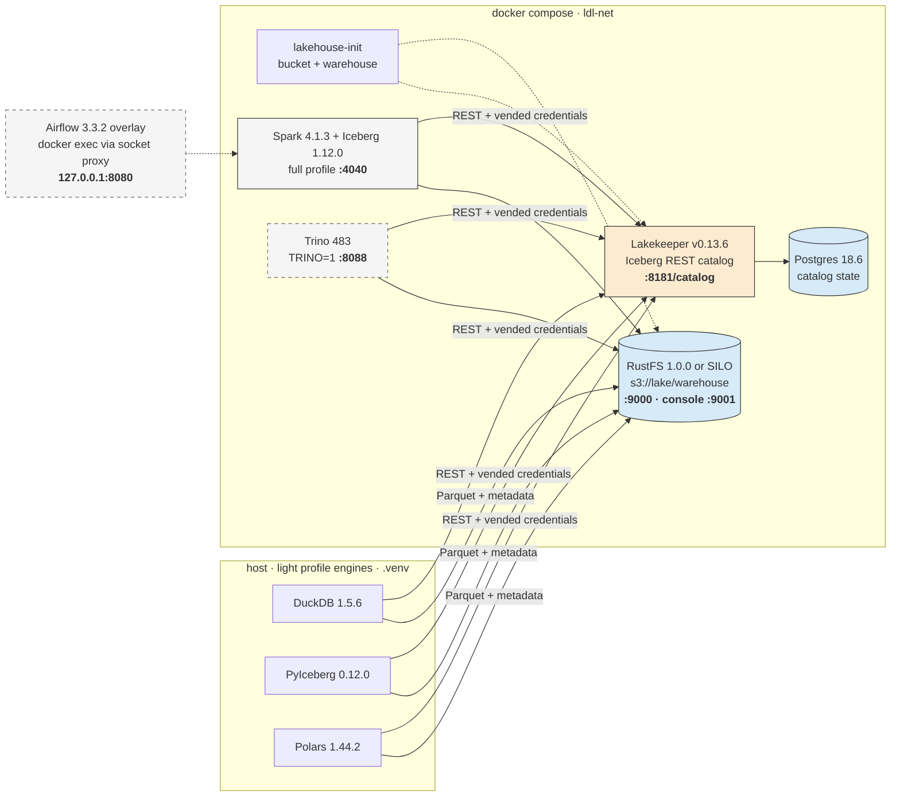
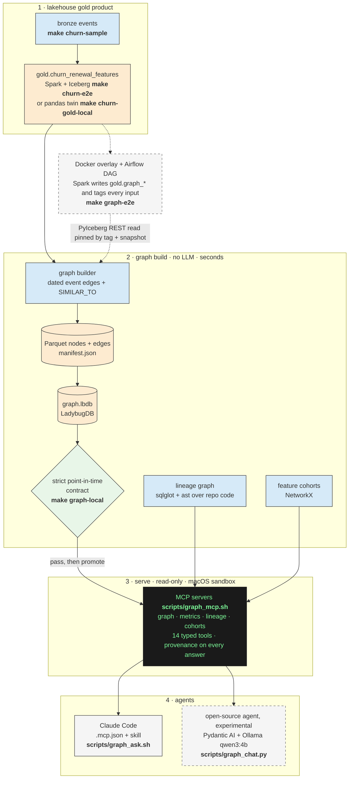

# local-data-lakehouse

Open-source **data lakehouse on your laptop**: Apache Iceberg tables behind one **Iceberg REST catalog**
(Lakekeeper), on an S3-compatible object store (RustFS, or SILO), queried by **DuckDB, PyIceberg and
Polars on the host** (no JVM) or by **Spark 4.1 and Trino** in containers.

This repository is the **hands-on companion** to the article *Stop Reading About Lakehouses. Build One
Locally.* It contains Compose files, jobs, sample data, tests and verified demos (no article prose).

| Component | Role |
|---|---|
| **Lakekeeper** v0.13.6 | Iceberg REST catalog; vends short-lived S3 credentials per table ([config/CATALOG.md](config/CATALOG.md)) |
| **PostgreSQL** 18.6 | Lakekeeper's state (no engine talks to it) |
| **RustFS** 1.0.0 (default) / **SILO** (`STORE=silo`) | S3-compatible object store, bucket `lake` ([docs/object-store.md](docs/object-store.md)) |
| **Apache Iceberg** 1.12.0 | ACID tables, snapshots, time travel |
| **DuckDB / PyIceberg / Polars** | Host engines of the `light` profile |
| **Apache Spark** 4.1.3 | Ingest, transform, SQL (`full` profile) |
| **Trino** 483 | Optional SQL engine (`TRINO=1`), cross-engine parity |
| **Apache Airflow** 3.3.2 | Optional overlay that schedules the Spark jobs |

**Two runnable paths**

1. **Retail**: bronze → silver → gold metrics + Iceberg time travel
2. **Renewal features**: billing and usage events of a monthly AI coding assistant →
   `gold.churn_renewal_features` (each renewal's features as of T-7) → CSV + JSON export

> **TEACHING-ONLY. NOT PRODUCTION.** `.env.example` holds **sample local-only credentials** (object store
> keys, Postgres password, Lakekeeper encryption key); `.env` is gitignored, so change them before you
> share a machine. Lakekeeper runs **without authentication**, and the catalog (8181), S3 API (9000),
> store console (9001), Spark UI (4040) and Trino (8088) ports are published on all interfaces. The
> Airflow overlay generates its own secrets and binds its UI to 127.0.0.1, but its socket proxy reads the
> host Docker socket. Do **not** expose this stack on a network.

## Architecture


```mermaid
flowchart LR
  subgraph HOST["host · light profile engines · .venv"]
    direction TB
    DUCK["DuckDB 1.5.6"]
    PYI["PyIceberg 0.12.0"]
    POL["Polars 1.44.2"]
  end

  subgraph STACK["docker compose · ldl-net"]
    direction TB
    LK["Lakekeeper v0.13.6<br/>Iceberg REST catalog<br/><b>:8181/catalog</b>"]
    PG[("Postgres 18.6<br/>catalog state")]
    OS[("RustFS 1.0.0 or SILO<br/>s3://lake/warehouse<br/><b>:9000 · console :9001</b>")]
    INIT["lakehouse-init<br/>bucket + warehouse"]
    SP["Spark 4.1.3 + Iceberg 1.12.0<br/>full profile <b>:4040</b>"]
    TR["Trino 483<br/>TRINO=1 <b>:8088</b>"]
  end

  AF["Airflow 3.3.2 overlay<br/>docker exec via socket proxy<br/><b>127.0.0.1:8080</b>"]

  LK --> PG
  INIT -.-> OS
  INIT -.-> LK
  DUCK & PYI & POL -->|REST + vended credentials| LK
  SP & TR -->|REST + vended credentials| LK
  DUCK & PYI & POL -->|Parquet + metadata| OS
  SP & TR --> OS
  AF -.-> SP

  style LK fill:#fdebd0,stroke:#333
  style OS fill:#d6eaf8,stroke:#333
  style PG fill:#d6eaf8,stroke:#333
  style SP fill:#f5f5f5,stroke:#333
  style TR fill:#f5f5f5,stroke:#666,stroke-dasharray: 5 5
  style AF fill:#f5f5f5,stroke:#666,stroke-dasharray: 5 5
```

Every engine asks Lakekeeper for a table; Lakekeeper answers with the metadata location **and**
short-lived S3 credentials plus the endpoint `http://objectstore.localhost:9000`, which resolves to the
store both inside `ldl-net` (a network alias) and on the host (loopback). No engine holds the store's
keys; only Lakekeeper and `lakehouse-init` do.

| Profile | Services | Start | Use it for |
|---|---|---|---|
| `light` | postgres, lakekeeper-migrate (one-shot), lakekeeper, objectstore, lakehouse-init | `make up-light` | `make demo-light`, T2; host engines only, no JVM |
| `full` | light + spark | `make up-full` | `make e2e`, `make churn-e2e`, `make demo` |
| `full` + `trino` | full + trino | `make up-full TRINO=1` | T3 parity, Trino SQL |
| `STORE=silo` | SILO instead of RustFS (same service name `objectstore`) | `make up-light STORE=silo` | the alternative store |
| Airflow overlay | api-server, scheduler, dag-processor, metadata Postgres, socket proxy | `make airflow-up` | scheduling the Spark jobs |
| Graph overlay | `ldl-graph` (Python 3.12) | `make graph-e2e` | the graph on gold, read through the REST catalog |

### Graph on gold: an agent layer over the renewal gold

The renewal gold also feeds a small, deterministic graph that an AI agent can query. Every event edge
carries its date, so the agent can cite exactly what the model could see at T-7, show similar past
renewals with their outcomes, count the blast radius of incidents and pricing changes, and trace any
feature back through the pipeline. It explains; it does not predict. Everything runs locally with
open-source parts (LadybugDB, NetworkX, sqlglot, the MCP Python SDK, Pydantic AI, Ollama), and the
default path needs no Docker.


```mermaid
flowchart TB
  subgraph LAKE["1 · lakehouse gold product"]
    direction LR
    BR["bronze events<br/><b>make churn-sample</b>"] --> GD["gold.churn_renewal_features<br/>Spark + Iceberg <b>make churn-e2e</b><br/>or pandas twin <b>make churn-gold-local</b>"]
  end

  subgraph BUILD["2 · graph build · no LLM · seconds"]
    direction LR
    GB["graph builder<br/>dated event edges + SIMILAR_TO"] --> PQ[("Parquet nodes + edges<br/>manifest.json")] --> LB[("graph.lbdb<br/>LadybugDB")] --> CK{"strict point-in-time<br/>contract<br/><b>make graph-local</b>"}
    LX["lineage graph<br/>sqlglot + ast over repo code"]
    CO["feature cohorts<br/>NetworkX"]
  end

  subgraph SERVE["3 · serve · read-only · macOS sandbox"]
    MCP["MCP servers <b>scripts/graph_mcp.sh</b><br/>graph · metrics · lineage · cohorts<br/>14 typed tools · provenance on every answer"]
  end

  subgraph AGENTS["4 · agents"]
    direction LR
    CC["Claude Code<br/>.mcp.json + skill<br/><b>scripts/graph_ask.sh</b>"]
    OSS["open-source agent, experimental<br/>Pydantic AI + Ollama qwen3:4b<br/><b>scripts/graph_chat.py</b>"]
  end

  TWIN["Docker overlay + Airflow DAG<br/>Spark writes gold.graph_* and tags every input<br/><b>make graph-e2e</b>"]

  GD --> GB
  GD -.-> TWIN
  TWIN -.->|PyIceberg REST read pinned by tag + snapshot| GB
  CK -->|pass, then promote| MCP
  LX --> MCP
  CO --> MCP
  MCP --> CC
  MCP --> OSS

  style BR fill:#d6eaf8,stroke:#333
  style GD fill:#fdebd0,stroke:#333
  style GB fill:#d6eaf8,stroke:#333
  style PQ fill:#fdebd0,stroke:#333
  style LB fill:#fdebd0,stroke:#333
  style CK fill:#e8f6e8,stroke:#333
  style LX fill:#d6eaf8,stroke:#333
  style CO fill:#d6eaf8,stroke:#333
  style MCP fill:#1a1a1a,color:#7CFC98,stroke:#1a1a1a
  style CC fill:#f5f5f5,stroke:#333
  style OSS fill:#f5f5f5,stroke:#666,stroke-dasharray: 5 5
  style TWIN fill:#f5f5f5,stroke:#666,stroke-dasharray: 5 5
```

| Stage | What happens | Command |
|---|---|---|
| **gold** | The renewal gold, from Spark + Iceberg or its pandas twin | `make churn-e2e` · `make churn-gold-local` |
| **graph build** | 40,204 nodes / 130,366 edges at seed 42, built in seconds; the contract proves point-in-time parity with gold and that a naive traversal is wrong | `make graph-venv && make graph-local && make graph-promote` |
| **lineage + cohorts** | A lineage graph of the pipeline code and feature cohorts, beside the business graph | `scripts/build_lineage_local.py` · `scripts/build_graph_cohorts.py` |
| **serve** | Read-only MCP servers over the promoted build, under `sandbox-exec` on macOS | `.mcp.json` · `scripts/graph_mcp.sh` |
| **agents** | Claude Code limited to the lakehouse servers, or a local open-source agent (experimental; its own venv, `requirements-graph-eval.txt`) | `scripts/graph_ask.sh` · `scripts/graph_chat.py` |
| **Docker path** *(optional)* | Spark publishes `gold.graph_*` to Iceberg with tags; the graph container reads them back through the REST catalog (no credentials of its own) | `make graph-e2e` (178 s measured) |

Dashed boxes are optional (Docker) or experimental (the local-model agent). There is no chat UI.
Docs, results and charts: [docs/graph/README.md](docs/graph/README.md). The graph layer has its own
TEACHING-ONLY banner and threat model in [docs/graph/agent.md](docs/graph/agent.md).

---

## Prerequisites

| Requirement | Notes |
|---|---|
| Docker Desktop (or another engine) with **Compose v2.24+** | tested with Compose v5.5.1; `!override` in the SILO overlay needs 2.24+ |
| Make, Git | macOS / most Linux |
| [uv](https://docs.astral.sh/uv/) | `make venv` builds `.venv` (Python 3.12) from the hash-locked `requirements.txt` |
| Java 17 or 21 | only for `make churn-parity` (local pyspark 4.1.3) |
| Ports free | `8181` Lakekeeper, `9000` S3 API, `9001` store console, `4040` Spark UI, `8088` Trino, `8080` Airflow (all configurable in `.env`) |
| Host resolver | `objectstore.localhost` must resolve to loopback (macOS, systemd-resolved and glibc 2.36+ do; else add `127.0.0.1 objectstore.localhost` to `/etc/hosts`) |

Apple Silicon (arm64) and amd64 are supported (every image is multi-arch).

### Measured on the Mac (macOS arm64, Docker Desktop, 2026-10-02)

Startup is `make up-*` with images already pulled or built (`up -d --wait`, until every healthcheck passes):

| Profile | Cold start (empty volumes) | Warm restart | Memory (`docker stats`) |
|---|---:|---:|---|
| light (RustFS) | 8.1 s | 7.2 s | idle: postgres 53 + lakekeeper 21 + RustFS 113 + init 2 MiB ≈ **190 MiB**; after `make demo-light` ≈ 250 MiB |
| light, `STORE=silo` | 8.7 s (one run 17.2 s) | | after `make demo-light`: SILO 182–196 MiB, postgres 76 MiB, lakekeeper 27–36 MiB |
| full | 18.7 s | | as light, + spark about 2 MiB between jobs and **about 1.2 GiB** while a job runs |
| full + Trino | +24 s on a running full stack | 33.4 s | + Trino **865 MiB** idle, 1,011 MiB after jobs |
| Airflow overlay | 65 s (`make airflow-up`, image built) | | + about **1.16 GiB** (scheduler 648, api-server 278, dag-processor 180, Postgres 50, proxy 9 MiB) |
| Graph overlay | | | `ldl-graph` is capped at `mem_limit` 1,536 MiB |

The first `make up-full` also builds the Spark image (base image + Iceberg jars, sha256-checked).
Plan on 4 GB of free RAM for `full` + Trino and 6 GB with Airflow.

---

## Quick start

```bash
git clone https://github.com/santoshshinde2012/local-data-lakehouse.git
cd local-data-lakehouse
make env              # .env from .env.example (local-only sample values)
make venv             # .venv with DuckDB / PyIceberg / Polars (uv, hash-checked)
```

### Light profile (no JVM)

```bash
make up-light         # Postgres + Lakekeeper + RustFS + init, waits for health (about 8 s)
make demo-light       # retail medallion + churn twin with DuckDB / PyIceberg / Polars
make down
```

Excerpt: [docs/demo/light-demo.excerpt.md](docs/demo/light-demo.excerpt.md).

### Full profile (Spark)

```bash
make up-full          # light + Spark 4.1.3 (builds ldl-spark on first run)
make churn-sample     # bronze events for the renewal path -> data/sample/churn/*.csv
make demo             # make e2e (retail) + make churn-e2e (renewal gold + export)
make down
```

On Linux, the Spark container (uid 185) writes `data/export`: run `chmod a+rwx data/export` once.

### Trino

```bash
make up-full TRINO=1  # + Trino 483 on http://localhost:8088
docker compose --profile full --profile trino exec trino trino --execute \
  "SELECT * FROM lakehouse.gold.daily_order_metrics ORDER BY order_date"
```

### SILO instead of RustFS

```bash
make purge                       # catalog and objects must match: start from empty volumes
make up-light STORE=silo         # or: docker compose -f docker-compose.yml -f docker-compose.silo.yml --profile light up -d --wait
make demo-light
make down
```

`STORE=silo` works on every `up` / `test` target. See [docs/object-store.md](docs/object-store.md).

### Airflow 3 overlay

```bash
make up-full
make airflow-up       # generates Fernet / JWT / API secrets and the UI password into .env (first run)
make airflow-demo     # triggers lakehouse_retail_medallion, then lakehouse_churn_features
make airflow-down     # removes only the Airflow services
```

UI: http://localhost:8080 (127.0.0.1 only). User `admin` (`_AIRFLOW_WWW_USER_USERNAME`), password
`_AIRFLOW_WWW_USER_PASSWORD` in `.env`.

### Without Make

```bash
cp .env.example .env
docker compose --profile full up -d --build --wait
./pipelines/run_retail_e2e.sh
cp data/sample/churn/fixtures/tiny/*.csv data/sample/churn/   # or: python3 scripts/generate_churn_sample.py
./pipelines/run_churn_e2e.sh
docker compose --profile '*' down
```

---

## Expected results (contract)

### Retail (`make e2e`, or `make demo-light` on the light profile)

| order_date | orders | revenue | AOV |
|---|---:|---:|---:|
| 2024-03-01 | 10 | 424.94 | 60.71 |
| 2024-03-02 | 9 | 537.94 | 76.85 |

Also verify:

- Bronze orders ≈ **22** rows → silver **19** (dedupe + drop pending)
- Customer **Santosh Shinde** (`c-01`) on order `o-1001`
- Iceberg time travel: `bronze.orders_raw` at the day-1 snapshot reads **10** rows (DuckDB, PyIceberg and
  Polars in the light demo; `VERSION AS OF` in Spark), the current snapshot **22**

Excerpt: [docs/demo/retail-e2e.excerpt.md](docs/demo/retail-e2e.excerpt.md).

### Renewal features (`make churn-e2e`)

The source systems of a self-serve AI coding assistant (Pro $20 · Pro+ $60 · Ultra $200 a month), as raw events:

| Bronze table | From | Grain |
|---|---|---|
| `churn_subscription_snapshots_raw` | billing snapshot | subscription × snapshot date (`current_period_end`) |
| `churn_invoices_raw` | billing | invoice attempt (paid / failed, dunning retries) |
| `churn_subscription_events_raw` | billing | `cancel_scheduled`, `canceled` |
| `churn_usage_raw` | product analytics | subscription × active day (IDE, CLI, agent, suggestions) |
| `churn_limit_events_raw` | rate limiter | one row per blocked request (5-hour / weekly cap) |
| `churn_overage_settings_raw`, `churn_overage_charges_raw` | billing | overage switched on/off; overage billed |
| `churn_incidents_raw` | status page | incident windows |
| `churn_support_tickets_raw` | helpdesk | ticket opened |
| `churn_pricing_changes_raw` | product | date the plan caps were cut |

Gold (`sql/churn/gold_renewal_features.sql`) builds one row per renewal from the snapshot taken seven days before it:

- **Point in time.** Every feature reads events dated on or before T-7. Bronze keeps usage and cap hits after T-7 on purpose; the gold SQL must ignore them.
- **Label from billing.** A paid invoice at the renewal date means renewed. A cancel that takes effect at the renewal date is a voluntary lapse. A failed invoice followed by a cancellation after retries is involuntary.
- **Routes.** Renewals lost to failed cards go to **dunning**. Voluntary lapses whose cancel was already scheduled by T-7 go to the **cancel flow**. Both are kept out of the train export. A renewal whose T-7 is today is **score_today**: it is exported for inference, with no label.

| Artifact | Location |
|---|---|
| Gold table | `lakehouse.gold.churn_renewal_features` |
| Pandas twin (light demo, T3) | `lakehouse.gold.churn_renewal_features_twin` |
| Train CSV | `data/export/churn_user_features.csv` (24-field contract + `churned`) |
| Audit CSV | `data/export/churn_renewals_audit.csv` |
| Inference JSON | `data/export/hero_inference_record.json` (`sub_maya`, scored as of the latest snapshot) |

Seed 42, `make churn-sample` (8,000 subscriptions): 7,387 renewals routed to the model (7.4% voluntary lapse), 326 to dunning, 287 to the cancel flow, and one scored today.

Excerpt: [docs/demo/churn-e2e.excerpt.md](docs/demo/churn-e2e.excerpt.md).

### Without Docker, and checking Spark against pandas

```bash
make venv
make churn-sample          # bronze events → data/sample/churn/*.csv
make churn-gold-local      # pandas gold → data/export/ (+ contract check)
make churn-check           # re-validate data/export/ against the retention-radar contract
uv pip install --python .venv/bin/python pyspark==4.1.3   # once; needs Java 17 or 21
make churn-parity          # run the gold SQL in local Spark 4.1.3 and compare with pandas row by row
```

`churn-check` fails on structural breaks: columns, nulls, plan tiers, 0/1 flags, `active_days_7d > active_days_28d`, dunning or cancel-flow rows in the train export, and label or metadata leaking into the inference JSON. It warns on schema range breaches (`--strict` fails on them). CI runs `churn-parity` on the tiny fixture and the full sample (measured locally: 23.6 s and 20.8 s).

A 120-subscription fixture lives in `data/sample/churn/fixtures/tiny/` for quick demos. Sufficiency notes: [docs/churn-gold-sufficiency.md](docs/churn-gold-sufficiency.md).

The exports feed [retention-radar](https://github.com/santoshshinde2012/retention-radar):
`./pipelines/radar_consume.sh` checks out radar's v2 consumer (`RADAR_REF`, else a radar branch named
like this one, else the pinned commit of radar's `feat/coding-assistant-renewal-v2`), syncs the export
into its `data/external/` and batch-scores it (7,387 rows in a Linux container). Model choice,
calibration and the renewal policy live there, not in this lakehouse.

| Knob | Env / Make | Default |
|------|------------|---------|
| Subscriptions | `N_USERS` | 8000 |
| Seed | `CHURN_SEED` | 42 |
| Inference subscriber | `CHURN_HERO_ID` | `sub_maya` |

---

## Tests

| Tier | Command | Needs | What it proves | Measured |
|---|---|---|---|---|
| T0 | `make test-t0` | `.venv` | static stack checks (tag + digest pins, non-root, healthchecks, no keys in clients, versions in this README), client and SQL contracts | 19 passed in 1.5 s |
| T1 | `make test-t1` | Docker | REST catalog contract on throwaway Postgres + Lakekeeper + RustFS (testcontainers): appends, overwrite, delete, snapshots, time travel in PyIceberg / DuckDB / Polars | 5 passed in 11.7 s |
| T2 | `make test-t2` | Docker | brings up `light`; init idempotency; the light demo contract | 6 passed in 3.0 s (SILO 4.25 s) |
| T3 | `make test-t3` | Docker, about 4 GB | brings up `full` + Trino; Spark pipelines, then the same tables in Spark, Trino, DuckDB, PyIceberg and Polars; Spark gold vs pandas twin | 7 passed in 234.7 s (from empty volumes) |
| graph | `make graph-test` | `.venv-graph` | the graph layer's own suite | about 13 min; see [docs/graph/README.md](docs/graph/README.md#status) for the known failures |

`make test` runs T0–T3. CI (`.github/workflows/ci.yml`) runs T0, the graph job and T1 + T2 on every pull
request, and T3 on pushes to `main` or pull requests labelled `full-stack`.

## Make targets

| Target | What it does |
|---|---|
| `make env` / `make venv` | `.env` from `.env.example`; `.venv` (Python 3.12) from `requirements.txt` |
| `make up-light` · `make up-full [TRINO=1]` | start a profile and wait for health (`STORE=silo` swaps the store) |
| `make wait` · `make ps` · `make logs` · `make stats` | health wait, status, logs, `docker stats` of this project |
| `make demo-light` · `make e2e` · `make churn-e2e` · `make demo` | the demos (light; Spark retail; Spark renewal; both) |
| `make churn-sample` · `make churn-gold-local` · `make churn-check` · `make churn-parity` | the no-Docker renewal path |
| `make test-t0` … `make test-t3` · `make test` · `make graph-test` | test tiers |
| `make airflow-up` · `airflow-wait` · `airflow-trigger-retail` · `airflow-trigger-churn` · `airflow-demo` · `airflow-down` | Airflow overlay |
| `make graph-*` | graph on gold (`make help` lists them) |
| `make down` | stop every profile and overlay (volumes kept) |
| `make purge` | stop everything and delete **this project's** volumes only |
| `make reset` | `make purge`, then `make up-light` |

## Versions

All images are pinned by tag **and** multi-arch digest; `tests/unit/test_stack_static.py` fails when a
tag floats, a digest is missing, or this table drifts from the pins.

| Component | Version | Image / package | Source |
|---|---|---|---|
| PostgreSQL | 18.6 | `postgres:18.6-alpine` | https://hub.docker.com/_/postgres |
| Lakekeeper | v0.13.6 | `quay.io/lakekeeper/catalog:v0.13.6` | https://github.com/lakekeeper/lakekeeper/releases |
| RustFS | 1.0.0 | `rustfs/rustfs:1.0.0` | https://github.com/rustfs/rustfs/releases |
| SILO | RELEASE.2026-09-16T00-00-00Z | `pgsty/silo:RELEASE.2026-09-16T00-00-00Z` | https://github.com/pgsty/silo |
| curl (init) | 8.22.0 | `curlimages/curl:8.22.0` | https://hub.docker.com/r/curlimages/curl |
| Apache Spark | Spark 4.1.3 (Scala 2.13, Java 21) | `apache/spark:4.1.3-scala2.13-java21-python3-ubuntu` | https://spark.apache.org/downloads.html |
| Apache Iceberg | Iceberg 1.12.0 | `iceberg-spark-runtime-4.1_2.13`, `iceberg-aws-bundle` | https://iceberg.apache.org/releases/ |
| Trino | 483 | `trinodb/trino:483` | https://trino.io/docs/current/release.html |
| Apache Airflow | 3.3.2 | `apache/airflow:3.3.2-python3.12` | https://airflow.apache.org/docs/apache-airflow/stable/release_notes.html |
| socket-proxy | 1.13.1 | `wollomatic/socket-proxy:1.13.1` | https://github.com/wollomatic/socket-proxy |
| Docker CLI (Airflow image) | 29.8.2 | static binary, sha256-checked | https://download.docker.com/linux/static/stable/ |
| DuckDB | duckdb 1.5.6 | PyPI | https://pypi.org/project/duckdb/ |
| PyIceberg | pyiceberg 0.12.0 | PyPI | https://pypi.org/project/pyiceberg/ |
| Polars | polars 1.44.2 | PyPI | https://pypi.org/project/polars/ |
| PyArrow | pyarrow 25.0.1 | PyPI | https://pypi.org/project/pyarrow/ |
| testcontainers | 4.15.0 | PyPI | https://pypi.org/project/testcontainers/ |
| pyspark (parity check) | 4.1.3 | PyPI | https://pypi.org/project/pyspark/ |
| uv (CI) | 0.12.4 | PyPI | https://github.com/astral-sh/uv/releases |

**DuckDB 2.0** is due on 21 Oct 2026 and **1.5 reaches end of life on 1 Nov 2026**. This repo pins 1.5.6;
before moving to 2.0, re-lock `requirements.txt` and re-run `make test-t1 test-t2` (the iceberg
extension's `ATTACH` options may change). Spark 4.2 has no Iceberg runtime yet; 3.5.x is the LTS
fallback. The graph layer's local Spark harness stays on pyspark 3.5.3 ([MIGRATION.md](MIGRATION.md)).

---

## UIs while the stack is up

| Service | URL | Credentials |
|---|---|---|
| Lakekeeper REST catalog | http://localhost:8181/catalog | none (no auth; local only) |
| Store console (RustFS or SILO) | http://localhost:9001 | `S3_ACCESS_KEY` / `S3_SECRET_KEY` from `.env` (**sample-only**) |
| Spark UI | http://localhost:4040 | while a job runs |
| Trino | http://localhost:8088 | any user name, no password |
| Airflow | http://localhost:8080 | `admin` / generated `_AIRFLOW_WWW_USER_PASSWORD` in `.env` |

Objects live in bucket `lake` under `warehouse/`, one folder per Iceberg table.

---

## Orchestration with Apache Airflow 3

Airflow **schedules** the same Spark jobs; it does not replace the catalog, the store or Spark.

| DAG | Chain | Spark jobs |
|---|---|---|
| `lakehouse_retail_medallion` | `land_smoke >> bronze >> silver >> gold >> query_timetravel` | `src/jobs/retail/01` … `05` |
| `lakehouse_churn_features` | `bronze >> silver >> gold_features >> export_features` | `src/jobs/churn/01` … `04` |
| `lakehouse_graph` | `publish >> build >> contract >> lineage >> lineage_check >> cohorts >> promote` | `src/jobs/graph/01` + `ldl-graph` (needs the graph overlay) |

Each task is a `BashOperator` that runs `docker exec ldl-spark spark-submit …` (or `docker exec
ldl-graph …`). Airflow never sees the Docker socket: it talks to `docker-proxy`
(`wollomatic/socket-proxy`), which accepts connections only from the scheduler and only allows
`docker exec` into `ldl-spark` / `ldl-graph` (verified: `docker ps`, `docker run` and exec into other
containers are denied). Airflow runs non-root with the simple auth manager; DAGs are paused at
creation, example DAGs and config exposure are off. Excerpt:
[docs/demo/airflow-e2e.excerpt.md](docs/demo/airflow-e2e.excerpt.md).

```text
airflow/
  dags/           # lakehouse_retail_medallion, lakehouse_churn_features, lakehouse_graph (+ operators)
  auth/           # passwords.json for the simple auth manager (generated, gitignored)
  logs/ plugins/
docker/airflow/   # Airflow 3.3.2 image + static Docker CLI
docker-compose.airflow.yml
```

---

## Troubleshooting

| Symptom | Fix |
|---|---|
| Cannot connect to Docker | Start Docker Desktop; retry |
| Port already allocated | Free `8181` / `9000` / `9001` / `4040` / `8088` / `8080`, or change the `*_PORT` values in `.env` (keep `S3_ENDPOINT`'s port equal to `S3_API_PORT`) |
| Host engines: `Could not resolve host objectstore.localhost` | Add `127.0.0.1 objectstore.localhost` to `/etc/hosts` |
| A Spark job fails after the laptop slept: S3 `400 Bad Request`, `Failed to refresh storage credentials … Invalid credentials endpoint: null` | The vended credentials expired (Lakekeeper advertises no refresh endpoint). Re-run the job (`make e2e`, `make churn-e2e`, or the one `./pipelines/run_job.sh <job>`) |
| DuckDB: `Metadata-log exists but none of the entries were valid for the current transaction start time` | The connection was attached before another engine replaced the table: open a fresh connection (`lakehouse_client.duckdb_connect()`) |
| Polars hangs or calls `169.254.169.254` | Read with `reader_override="pyiceberg"` (`lakehouse_client.polars_scan` does) |
| `NoSuchBucket` or `warehouse … not found` | `./pipelines/create_bucket.sh` (re-runs `lakehouse-init --once`) |
| Odd counts or a catalog that does not match the objects (for example after switching `STORE`) | `make reset` (this project's volumes only) |
| Linux: Spark cannot write `data/export` | `chmod a+rwx data/export` (Spark runs as uid 185) |
| Linux: Airflow cannot read or write its bind mounts | `make airflow-up` writes `AIRFLOW_UID=$(id -u)` to `.env` on Linux; re-run it |
| `up --wait` fails with `required variable … is missing` | `make env` (or add the key from `.env.example` to your `.env`) |
| Old volumes from the JDBC-catalog era | Not readable by this stack (Postgres 18 refuses a 16 data directory): `make purge` ([MIGRATION.md](MIGRATION.md)) |
| Airflow never healthy | `docker compose -f docker-compose.yml -f docker-compose.airflow.yml --profile full logs airflow-apiserver` |

---

## Repository layout

```text
local-data-lakehouse/
  config/                 # spark-defaults.conf, log4j2, trino/ catalog, CATALOG.md
  docker/spark/           # Spark 4.1.3 + Iceberg 1.12.0 image
  docker/init/            # lakehouse-init bootstrap (bucket, warehouse)
  docker/airflow/ docker/graph/
  src/jobs/retail|churn|graph/   # Spark jobs, one stage each
  src/lakehouse_client/   # host client: REST catalog, DuckDB ATTACH, Polars scan
  src/lakehouse_graph/    # graph on gold
  scripts/                # light demo, pandas twin, checks, graph CLIs
  pipelines/              # wait, submit, e2e and Airflow helper scripts (no business logic)
  sql/retail|churn/       # companion DDL / gold SQL
  tests/unit|contract|smoke|parity|graph/   # T0 | T1 | T2 | T3 | graph
  data/sample/            # retail CSVs + churn tiny fixture (churn/*.csv generated by make churn-sample)
  data/export/            # generated outputs (gitignored except .gitkeep)
  docs/demo/              # verified demo excerpts
  docker-compose.yml  docker-compose.silo.yml  docker-compose.airflow.yml  docker-compose.graph.yml
  Makefile  MIGRATION.md
```

Design notes:

- **Single responsibility**: each job owns one stage; pipelines only sequence `spark-submit`
- **One catalog**: every engine reads and writes through the REST catalog; no engine has store keys
- **Stable contracts**: table names and gold metrics are documented here, in `config/CATALOG.md` and under `sql/`

The demo video of the earlier stack is not kept in the tree; see [docs/demo/README.md](docs/demo/README.md#demo-video).

---

## Related repos

**Reader start (renewal ML path):** after the gold export, open [retention-radar](https://github.com/santoshshinde2012/retention-radar) and follow that README's **Start here**.

| Repo | Role |
|------|------|
| [retention-radar](https://github.com/santoshshinde2012/retention-radar) | **Public** Retention Radar code + benchmarks + results (gold CSV/JSON consumer); **start here** for train → serve |
| This repo | **Public** data foundation / feature SoR (REST catalog · bronze→silver→gold→export) |
| Articles | Written in a separate **internal** workspace (not a reader destination) |

Medium / reader surfaces cite **only** the two public repos above.

## License

MIT © Santosh Shinde, see [LICENSE](LICENSE).
