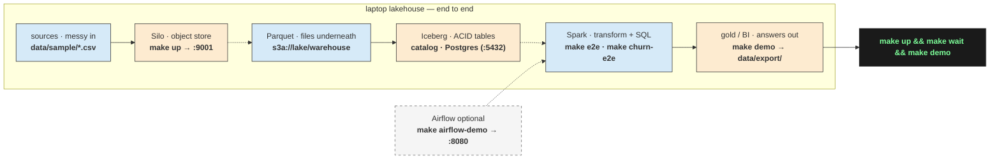
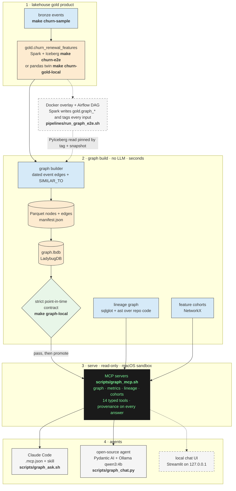

# local-data-lakehouse

Open-source **data lakehouse on your laptop** — Silo (S3-compatible object store), PostgreSQL (Iceberg JDBC catalog), Apache Spark 3.5, and Apache Iceberg.

This repository is the **hands-on companion** to the article *Stop Reading About Lakehouses. Build One Locally.* It contains Compose, jobs, sample data, and verified end-to-end demos only (no article prose).

| Component | Role |
|---|---|
| **Silo** | S3-compatible object store (MinIO lineage; [why we left MinIO](docs/object-store.md)) |
| **PostgreSQL** | Iceberg JDBC catalog |
| **Apache Spark 3.5** | Ingest, transform, query |
| **Apache Iceberg** | ACID tables, snapshots, time travel |

> **Why Silo (not MinIO)?** The MinIO community GitHub is archived (maintenance mode). This repo uses **SILO** (`pgsty/silo`) — a drop-in MinIO-compatible fork that keeps `MINIO_*` env names, disk format, and S3A/Iceberg paths working. Garage and RustFS were considered but not chosen for this teaching stack (partial S3 vs still-maturing Spark 3.5 path). Details: [docs/object-store.md](docs/object-store.md) · [silo.pgsty.com](https://silo.pgsty.com) · [github.com/pgsty/silo](https://github.com/pgsty/silo) · optional background: [maholick.com — MinIO is dead](https://maholick.com/blog/minio-is-dead-the-end-of-an-era-in-open-source-object-storage).

**Two runnable paths**

1. **Retail** — bronze → silver → gold metrics + Iceberg time travel  
2. **Renewal features** — billing and usage events of a monthly AI coding assistant → `gold.churn_renewal_features` (each renewal's features as of T-7) → CSV + JSON export  


> **TEACHING-ONLY — NOT PRODUCTION.** Default Silo (`minioadmin` / `minioadmin`) and Airflow (`admin` / `admin`) passwords are **sample credentials for local learning**. The optional Airflow overlay mounts the host **Docker socket** (`/var/run/docker.sock`) and runs as root so DAGs can `docker exec` into `ldl-spark`. Do **not** expose this stack on a network, reuse these passwords, or copy the socket mount into a real environment.

## Architecture

End-to-end path on your laptop — doodle map with commands highlighted on every stage:


| Stage | Role | Command |
|---|---|---|
| **sources** | Sample CSVs (retail + churn) | `data/sample/` |
| **Silo** | Object store, bucket `lake` | `make up` → http://localhost:9001 |
| **Parquet** | Files under the warehouse | `s3a://lake/warehouse` |
| **Iceberg** | ACID tables | catalog: **Postgres** (`make up`) |
| **Spark** | Ingest / transform / SQL | `make e2e` · `make churn-e2e` |
| **gold / BI** | Metrics + feature export | `make demo` → `data/export/` |
| **Airflow** *(optional)* | Same jobs, scheduled | `make airflow-demo` → http://localhost:8080 |


```mermaid
flowchart LR
  subgraph pipeline["laptop lakehouse — end to end"]
    direction LR
    S["sources · messy in<br/><b>data/sample/*.csv</b>"]
    M["Silo · object store<br/><b>make up → :9001</b>"]
    P["Parquet · files underneath<br/><b>s3a://lake/warehouse</b>"]
    I["Iceberg · ACID tables<br/><b>catalog · Postgres (:5432)</b>"]
    SP["Spark · transform + SQL<br/><b>make e2e · make churn-e2e</b>"]
    G["gold / BI · answers out<br/><b>make demo → data/export/</b>"]

    S --> M -.-> P --> I -.-> SP --> G
  end

  AF["Airflow optional<br/><b>make airflow-demo → :8080</b>"]
  AF -.-> SP

  FULL["<b>make up && make wait && make demo</b>"]
  G --> FULL

  style S fill:#d6eaf8,stroke:#333
  style M fill:#fdebd0,stroke:#333
  style P fill:#d6eaf8,stroke:#333
  style I fill:#fdebd0,stroke:#333
  style SP fill:#d6eaf8,stroke:#333
  style G fill:#fdebd0,stroke:#333
  style AF fill:#f5f5f5,stroke:#666,stroke-dasharray: 5 5
  style FULL fill:#1a1a1a,color:#7CFC98,stroke:#1a1a1a
```

Full path: `make up && make wait && make demo`.

### Graph on gold: an agent layer over the renewal gold

The renewal gold also feeds a small, deterministic graph that an AI agent can query. Every event edge
carries its date, so the agent can cite exactly what the model could see at T-7, show similar past
renewals with their outcomes, count the blast radius of incidents and pricing changes, and trace any
feature back through the pipeline. It explains; it does not predict. Everything runs locally with
open-source parts (LadybugDB, NetworkX, sqlglot, the MCP Python SDK, Ollama), and the default path needs
no Docker.


```mermaid
flowchart TB
  subgraph LAKE["1 · lakehouse gold product"]
    direction LR
    BR["bronze events<br/><b>make churn-sample</b>"] --> GD["gold.churn_renewal_features<br/>Spark + Iceberg <b>make churn-e2e</b><br/>or pandas twin <b>make churn-gold-local</b>"]
  end

  subgraph BUILD["2 · graph build · no LLM · seconds"]
    direction LR
    GB["graph builder<br/>dated event edges + SIMILAR_TO"] --> PQ[("Parquet nodes + edges<br/>manifest.json")] --> LB[("graph.lbdb<br/>LadybugDB")] --> CK{"strict point-in-time<br/>contract<br/><b>make graph-local</b>"}
    LX["lineage graph<br/>sqlglot + ast over repo code"]
    CO["feature cohorts<br/>NetworkX"]
  end

  subgraph SERVE["3 · serve · read-only · macOS sandbox"]
    MCP["MCP servers <b>scripts/graph_mcp.sh</b><br/>graph · metrics · lineage · cohorts<br/>14 typed tools · provenance on every answer"]
  end

  subgraph AGENTS["4 · agents"]
    direction LR
    CC["Claude Code<br/>.mcp.json + skill<br/><b>scripts/graph_ask.sh</b>"]
    OSS["open-source agent<br/>Pydantic AI + Ollama qwen3:4b<br/><b>scripts/graph_chat.py</b>"]
    UI["local chat UI<br/>Streamlit on 127.0.0.1"]
  end

  TWIN["Docker overlay + Airflow DAG<br/>Spark writes gold.graph_* and tags every input<br/><b>pipelines/run_graph_e2e.sh</b>"]

  GD --> GB
  GD -.-> TWIN
  TWIN -.->|PyIceberg read pinned by tag + snapshot| GB
  CK -->|pass, then promote| MCP
  LX --> MCP
  CO --> MCP
  MCP --> CC
  MCP --> OSS
  MCP -.-> UI

  style BR fill:#d6eaf8,stroke:#333
  style GD fill:#fdebd0,stroke:#333
  style GB fill:#d6eaf8,stroke:#333
  style PQ fill:#fdebd0,stroke:#333
  style LB fill:#fdebd0,stroke:#333
  style CK fill:#e8f6e8,stroke:#333
  style LX fill:#d6eaf8,stroke:#333
  style CO fill:#d6eaf8,stroke:#333
  style MCP fill:#1a1a1a,color:#7CFC98,stroke:#1a1a1a
  style CC fill:#f5f5f5,stroke:#333
  style OSS fill:#f5f5f5,stroke:#333
  style UI fill:#f5f5f5,stroke:#666,stroke-dasharray: 5 5
  style TWIN fill:#f5f5f5,stroke:#666,stroke-dasharray: 5 5
```

| Stage | What happens | Command |
|---|---|---|
| **gold** | The renewal gold, from Spark + Iceberg or its pandas twin | `make churn-e2e` · `make churn-gold-local` |
| **graph build** | 40,204 nodes / 130,366 edges at seed 42, built in seconds; the contract proves point-in-time parity with gold and that a naive traversal is wrong | `make graph-venv && make graph-local && make graph-promote` |
| **lineage + cohorts** | A lineage graph of the pipeline code and feature cohorts, beside the business graph | `scripts/build_lineage_local.py` · `scripts/build_graph_cohorts.py` |
| **serve** | Read-only MCP servers over the promoted build, under `sandbox-exec` on macOS | `.mcp.json` · `scripts/graph_mcp.sh` |
| **agents** | Claude Code limited to the lakehouse servers, or a fully local open-source agent | `scripts/graph_ask.sh` · `scripts/graph_chat.py` |
| **Docker path** *(optional)* | Spark publishes `gold.graph_*` to Iceberg with tags; the same builder reads them back by tag | `pipelines/run_graph_e2e.sh` |

Dashed boxes are optional paths (Docker) or still being finished (the local UI). Docs, results and charts: [docs/graph/README.md](docs/graph/README.md).
The graph layer has its own TEACHING-ONLY banner and threat model in [docs/graph/agent.md](docs/graph/agent.md).

---

## Prerequisites

| Requirement | Notes |
|---|---|
| Docker Desktop | Compose v2 enabled |
| Make | Ships with macOS / most Linux |
| RAM | ~8–16 GB recommended |
| Ports free | `9000`, `9001`, `5432`, `4040` |
| Python 3.10+ *(no-Docker churn path only; Retention Radar itself needs 3.12+)* | `pip install -r requirements.txt` (pandas + numpy) for `make churn-sample` / `churn-gold-local` / `churn-check` |

Apple Silicon (arm64) is supported.

---

## End-to-end instructions (full path)

Copy-paste this sequence on a clean machine:

```bash
# 1. Clone
git clone https://github.com/santoshshinde2012/local-data-lakehouse.git
cd local-data-lakehouse

# 2. Environment
cp .env.example .env

# 3. Start the stack (builds the Spark image on first run)
make up

# 4. Wait until Silo, Postgres, and Spark are healthy
make wait

# 5. Run the full demo: retail medallion + churn gold export
make demo
```

That is the complete path. When it finishes you should see:

- Retail gold metrics matching the contract below  
- `data/export/churn_user_features.csv` (renewals routed to the model)  
- `data/export/churn_renewals_audit.csv` (every renewal with outcome and route)  
- `data/export/hero_inference_record.json` (today's T-7 record, no label)  
- Silo console at http://localhost:9001 (`minioadmin` / `minioadmin`), bucket `lake`

### Step-by-step (what each command does)

| Step | Command | What happens |
|---:|---|---|
| 1 | `git clone …` | Fetch this repository |
| 2 | `cp .env.example .env` | Local env (`make up` already copies this if missing) |
| 3 | `make up` | `docker compose up -d --build` — Silo, Postgres, Spark |
| 4 | `make wait` | Polls health until the catalog and object store answer |
| 5a | `make e2e` | Retail jobs `src/jobs/retail/01` … `05` |
| 5b | `make churn-e2e` | Renewal-feature jobs `src/jobs/churn/01` … `04` |
| 5 | `make demo` | Runs **5a then 5b** (preferred for videos / walkthroughs) |

### Optional paths

```bash
# Retail only
make e2e

# Renewal features only (after the stack is up; catalog must exist)
make churn-e2e

# Wipe volumes and re-run retail from a clean warehouse
make reset

# Status / stop
make ps
make down
```

### Without Make

```bash
cp .env.example .env
docker compose up -d --build
./pipelines/wait_for_stack.sh
./pipelines/run_retail_e2e.sh
cp data/sample/churn/fixtures/tiny/*.csv data/sample/churn/   # or: python3 scripts/generate_churn_sample.py
./pipelines/run_churn_e2e.sh
```

---

## Expected results (contract)

### Retail (`make e2e` or first half of `make demo`)

| order_date | orders | revenue | AOV |
|---|---:|---:|---:|
| 2024-03-01 | 10 | 424.94 | 60.71 |
| 2024-03-02 | 9 | 537.94 | 76.85 |

Also verify:

- Bronze orders ≈ **22** rows → silver **19** (dedupe + drop pending)  
- Customer **Santosh Shinde** (`c-01`) on order `o-1001`  
- Iceberg time travel on `lakehouse.silver.orders` succeeds (count **19**)

### Renewal features (`make churn-e2e` or second half of `make demo`)

The source systems of a self-serve AI coding assistant (Pro $20 · Pro+ $60 · Ultra $200 a month), as raw events:

| Bronze table | From | Grain |
|---|---|---|
| `churn_subscription_snapshots_raw` | billing snapshot | subscription × snapshot date (`current_period_end`) |
| `churn_invoices_raw` | billing | invoice attempt (paid / failed, dunning retries) |
| `churn_subscription_events_raw` | billing | `cancel_scheduled`, `canceled` |
| `churn_usage_raw` | product analytics | subscription × active day (IDE, CLI, agent, suggestions) |
| `churn_limit_events_raw` | rate limiter | one row per blocked request (5-hour / weekly cap) |
| `churn_overage_settings_raw`, `churn_overage_charges_raw` | billing | overage switched on/off; overage billed |
| `churn_incidents_raw` | status page | incident windows |
| `churn_support_tickets_raw` | helpdesk | ticket opened |
| `churn_pricing_changes_raw` | product | date the plan caps were cut |

Gold (`sql/churn/gold_renewal_features.sql`) builds one row per renewal from the snapshot taken seven days before it:

- **Point in time.** Every feature reads events dated on or before T-7. Bronze keeps usage and cap hits after T-7 on purpose; the gold SQL must ignore them.
- **Label from billing.** A paid invoice at the renewal date means renewed. A cancel that takes effect at the renewal date is a voluntary lapse. A failed invoice followed by a cancellation after retries is involuntary.
- **Routes.** Renewals lost to failed cards go to **dunning**. Voluntary lapses whose cancel was already scheduled by T-7 go to the **cancel flow**. Both are kept out of the train export. A renewal whose T-7 is today is **score_today**: it is exported for inference, with no label.

| Artifact | Location |
|---|---|
| Gold table | `lakehouse.gold.churn_renewal_features` |
| Train CSV | `data/export/churn_user_features.csv` (24-field contract + `churned`) |
| Audit CSV | `data/export/churn_renewals_audit.csv` |
| Inference JSON | `data/export/hero_inference_record.json` (`sub_maya`, scored as of the latest snapshot) |

Seed 42, `make churn-sample` (8,000 subscriptions): 7,387 renewals routed to the model (7.4% voluntary lapse), 326 to dunning, 287 to the cancel flow, and one scored today.

### Without Docker, and checking Spark against pandas

```bash
pip install -r requirements.txt
make churn-sample          # bronze events → data/sample/churn/*.csv
make churn-gold-local      # pandas gold → data/export/ (+ contract check)
make churn-check           # re-validate data/export/ against the retention-radar contract
make churn-parity          # run the gold SQL in local Spark and compare with pandas row by row
```

`churn-check` fails on structural breaks: columns, nulls, plan tiers, 0/1 flags, `active_days_7d > active_days_28d`, dunning or cancel-flow rows in the train export, and label or metadata leaking into the inference JSON. It warns on schema range breaches (`--strict` fails on them). `churn-parity` needs Java 17 and `pip install pyspark==3.5.*`. CI runs it on the tiny fixture and the full sample.

A 120-subscription fixture lives in `data/sample/churn/fixtures/tiny/` for quick demos. Sufficiency notes: [docs/churn-gold-sufficiency.md](docs/churn-gold-sufficiency.md).

The exports feed [retention-radar](https://github.com/santoshshinde2012/retention-radar) (`./scripts/sync_lakehouse_exports.sh` → `data/external/`). Model choice, calibration and the renewal policy live there, not in this lakehouse.

| Knob | Env / Make | Default |
|------|------------|---------|
| Subscriptions | `N_USERS` | 8000 |
| Seed | `CHURN_SEED` | 42 |
| Inference subscriber | `CHURN_HERO_ID` | `sub_maya` |

---

## UIs while the stack is up

> **Sample credentials only** (see teaching banner above). Never reuse in production.

| Service | URL | Credentials |
|---|---|---|
| Silo console | http://localhost:9001 | `minioadmin` / `minioadmin` (**sample-only**) |
| Spark UI | http://localhost:4040 | (while a job is running) |

Warehouse prefix in Silo: bucket `lake` → Iceberg table folders under the warehouse path.

---

## Repository layout

```text
local-data-lakehouse/
  config/                 # Spark defaults + catalog notes
  docker/spark/           # Spark runtime image
  src/jobs/
    retail/               # 01 smoke → 05 query / time travel
    churn/                # 01 ingest → 04 export features
  pipelines/              # wait, submit, e2e scripts (no business logic)
  data/sample/            # retail CSVs + churn tiny fixture (churn/*.csv generated by make churn-sample)
  data/export/            # generated outputs (gitignored except .gitkeep)
  sql/retail|churn/       # companion DDL / contracts
  docs/demo/              # verified demo excerpts
  docker-compose.yml
  Makefile
```

Design notes:

- **Single responsibility** — each job owns one stage; pipelines only sequence `spark-submit`  
- **Open for extension** — add a domain folder under `src/jobs/` without touching retail  
- **Stable contracts** — table names and gold metrics documented here and under `sql/`

---


### Component → command map

| Component | Role | How you run it |
|---|---|---|
| Sample CSVs | Retail + churn inputs | Shipped under `data/sample/` |
| Silo | Object store (`lake`) | `make up` → http://localhost:9001 |
| Postgres | Iceberg JDBC catalog | `make up` (port `5432`) |
| Spark + Iceberg | Jobs + ACID tables | `make e2e` / `make churn-e2e` |
| Airflow | DAG orchestration | `make airflow-up` → http://localhost:8080 |
| Gold / export | Metrics + feature files | `make demo` or `make airflow-demo` |

## Orchestration with Apache Airflow

Airflow **schedules** the same Spark jobs; it does not replace Silo, Iceberg, or Spark.

| DAG | Chain | Spark jobs |
|---|---|---|
| `lakehouse_retail_medallion` | `land_smoke >> bronze >> silver >> gold >> query_timetravel` | `src/jobs/retail/01` … `05` |
| `lakehouse_churn_features` | `bronze >> silver >> gold_features >> export_features` | `src/jobs/churn/01` … `04` |

### Full path (lakehouse + Airflow)

```bash
git clone https://github.com/santoshshinde2012/local-data-lakehouse.git
cd local-data-lakehouse
cp .env.example .env

# 1. Lakehouse foundation
make up
make wait

# 2. Airflow (separate metadata Postgres + webserver + scheduler)
make airflow-up
make airflow-wait

# 3. Trigger DAGs (unpause + run + wait for success)
make airflow-demo
```

Or trigger one path:

```bash
make airflow-trigger-retail
make airflow-trigger-churn
```

| Item | Value |
|---|---|
| Airflow UI | http://localhost:8080 |
| Login | `admin` / `admin` (**sample-only** — teaching laptop) |
| Silo | http://localhost:9001 (`minioadmin` / `minioadmin`, **sample-only**) |

Shell `make demo` remains valid if you skip Airflow. Both paths must produce the same gold contracts and exports.

### Airflow layout

```text
airflow/
  dags/           # lakehouse_retail_medallion, lakehouse_churn_features
  logs/           # runtime (gitignored)
  plugins/
docker/airflow/   # Airflow image + Docker CLI (exec into ldl-spark)
docker-compose.airflow.yml
```

Each task runs `docker exec ldl-spark spark-submit …` against the existing job scripts. **Teaching-only:** Airflow containers mount the host **Docker socket** and run as root so the DAG can reach `ldl-spark`. That is a full host-docker privilege — fine on a closed laptop demo; **never** ship this pattern to a shared or production host.

### Extra resources

Airflow needs additional RAM beyond the core stack (plan ~4+ GB free for webserver + scheduler + metadata DB).

| Command | What it does |
|---|---|
| `make airflow-up` | Build/start Airflow overlay on `ldl-net` |
| `make airflow-wait` | Wait until http://localhost:8080/health |
| `make airflow-trigger-retail` | Unpause + run retail DAG |
| `make airflow-trigger-churn` | Unpause + run churn DAG |
| `make airflow-demo` | Both DAGs via Airflow |
| `make airflow-down` | Stop Airflow services only |


## Troubleshooting

| Symptom | Fix |
|---|---|
| Cannot connect to Docker | Start Docker Desktop; retry `make up` |
| Port already allocated | Free `9000` / `9001` / `5432` / `4040`, or change values in `.env` |
| `NoSuchBucket` | `./pipelines/create_bucket.sh` or `make reset` |
| JDBC / catalog errors | `make wait`, then `make ps`; ensure Postgres is healthy |
| Missing Iceberg / S3 jars | `docker compose build --no-cache spark && make up` |
| Dirty warehouse / odd counts | `make reset` then `make churn-e2e` |
| First `make up` is slow | Normal — Spark image build downloads jars once |
| Airflow UI never healthy | `make airflow-up` again; check `docker compose -f docker-compose.yml -f docker-compose.airflow.yml logs airflow-webserver` |
| DAG task cannot `docker exec` | Ensure `ldl-spark` is up (`make ps`); Docker socket mounted in Airflow overlay |
| Port 8080 busy | Set `AIRFLOW_WEBSERVER_PORT` in `.env` **and** export it in your shell (e.g. `export AIRFLOW_WEBSERVER_PORT=8081`) so `make airflow-wait` polls the same port |

---


## Related repos

**Reader start (renewal ML path):** after gold export, open [retention-radar](https://github.com/santoshshinde2012/retention-radar) and follow that README’s **Start here**.

| Repo | Role |
|------|------|
| [retention-radar](https://github.com/santoshshinde2012/retention-radar) | **Public** Retention Radar code + benchmarks + results (gold CSV/JSON consumer) — **start here** for train → serve |
| This repo | **Public** data foundation / feature SoR (SILO · bronze→silver→gold→export) |
| Articles | Written in a separate **internal** workspace (not a reader destination) |

Medium / reader surfaces cite **only** the two public repos above.

## License

MIT © Santosh Shinde — see [LICENSE](LICENSE).
