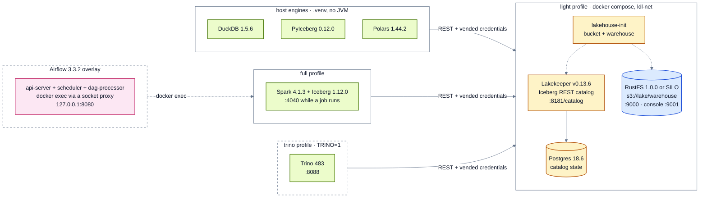

# local-data-lakehouse

**A complete, open-source data lakehouse on your laptop: Apache Iceberg tables, one REST catalog, and the engines you already know, up in about ten seconds.**

[](https://github.com/santoshshinde2012/local-data-lakehouse/actions/workflows/ci.yml)
[](LICENSE)
[](https://www.python.org/downloads/release/python-3120/)
[](https://docs.docker.com/compose/)

## What it is

local-data-lakehouse runs a small but real lakehouse with Docker Compose:

- **Apache Iceberg 1.12** tables with snapshots and time travel;
- **Lakekeeper**, an Iceberg REST catalog that hands each engine short-lived storage credentials;
- **RustFS** (or SILO) as the S3-compatible object store;
- **DuckDB, PyIceberg and Polars** on the host (no JVM), or **Spark 4.1** and **Trino** in containers;
- an optional **Apache Airflow 3** overlay that schedules the Spark jobs.

It ships two runnable pipelines: a **retail** medallion (bronze → silver → gold, with time travel) and a
**renewal-features** pipeline that turns billing and usage events into a point-in-time feature table for
[retention-radar](https://github.com/santoshshinde2012/retention-radar). A graph layer on the gold table
lets an AI agent explain renewals with dated evidence.

**Who it is for:** data engineers, ML engineers and students who want to learn the lakehouse pattern
hands-on, test an engine change, or build features the way a production team would, all on one machine.
It is the companion repo to the article *Stop Reading About Lakehouses. Build One Locally.*

> **Teaching stack, not production.** `.env.example` holds sample local-only credentials, Lakekeeper runs
> without authentication and the service ports listen on all interfaces. Keep it on your own machine.

## Architecture


```mermaid
%%{init: {"theme": "base", "flowchart": {"wrappingWidth": 360}, "themeVariables": {"primaryColor": "#CCFBF1", "primaryTextColor": "#0F172A", "primaryBorderColor": "#0F766E", "lineColor": "#64748B", "textColor": "#0F172A", "edgeLabelBackground": "#FFFFFF", "clusterBkg": "#FFFFFF", "clusterBorder": "#64748B", "titleColor": "#0F172A", "attributeBackgroundColorOdd": "#FFFFFF", "attributeBackgroundColorEven": "#F0FDFA", "relationColor": "#64748B", "relationLabelBackground": "#FFFFFF", "relationLabelColor": "#0F172A"}}}%%
flowchart LR
  subgraph HOSTP["host engines · .venv, no JVM"]
    direction TB
    DUCK["DuckDB 1.5.6"]
    PYI["PyIceberg 0.12.0"]
    POL["Polars 1.44.2"]
  end
  subgraph LIGHT["light profile · docker compose, ldl-net"]
    direction TB
    INIT["lakehouse-init<br/>bucket + warehouse"]
    LK["Lakekeeper v0.13.6<br/>Iceberg REST catalog<br/>:8181/catalog"]
    PG[("Postgres 18.6<br/>catalog state")]
    OS[("RustFS 1.0.0 or SILO<br/>s3://lake/warehouse<br/>:9000 · console :9001")]
    INIT -.-> LK
    INIT -.-> OS
    LK --> PG
  end
  subgraph FULL["full profile"]
    SP["Spark 4.1.3 + Iceberg 1.12.0<br/>:4040 while a job runs"]
  end
  subgraph TRINOP["trino profile · TRINO=1"]
    TR["Trino 483<br/>:8088"]
  end
  subgraph AIR["Airflow 3.3.2 overlay"]
    AF["api-server + scheduler + dag-processor<br/>docker exec via a socket proxy<br/>127.0.0.1:8080"]
  end

  HOSTP -->|"REST + vended credentials"| LIGHT
  FULL -->|"REST + vended credentials"| LIGHT
  TRINOP -->|"REST + vended credentials"| LIGHT
  AIR -.->|"docker exec"| FULL

  classDef storage fill:#DBEAFE,stroke:#1D4ED8,color:#0F172A,stroke-width:1.5px
  classDef catalog fill:#FEF3C7,stroke:#B45309,color:#0F172A,stroke-width:1.5px
  classDef compute fill:#ECFCCB,stroke:#4D7C0F,color:#0F172A,stroke-width:1.5px
  classDef orchestration fill:#FCE7F3,stroke:#BE185D,color:#0F172A,stroke-width:1.5px
  classDef graphlayer fill:#CCFBF1,stroke:#0F766E,color:#0F172A,stroke-width:1.5px
  classDef consumer fill:#FFEDD5,stroke:#C2410C,color:#0F172A,stroke-width:1.5px
  classDef data fill:#F1F5F9,stroke:#475569,color:#0F172A,stroke-width:1.5px
  class OS storage
  class LK,PG,INIT catalog
  class DUCK,PYI,POL,SP,TR compute
  class AF orchestration
  style TRINOP stroke-dasharray:5 5
  style AIR stroke-dasharray:5 5
```

Every engine asks Lakekeeper for a table. Lakekeeper answers with the table's metadata location and
short-lived S3 credentials, so no engine ever holds the store's keys. Dashed boxes are optional. The
full drawing with the graph overlay and the consumers is in [RESULTS.md](RESULTS.md); diagram rules are
in [docs/diagrams.md](docs/diagrams.md).

## Quick start

You need Docker with Compose v2.24+, Make, Git and [uv](https://docs.astral.sh/uv/). Details and ports:
[docs/reference.md](docs/reference.md#prerequisites).

```bash
git clone https://github.com/santoshshinde2012/local-data-lakehouse.git
cd local-data-lakehouse
make env          # .env from .env.example (local-only sample values)
make venv         # .venv with DuckDB, PyIceberg and Polars (Python 3.12, hash-checked)

make up-light     # Postgres + Lakekeeper + RustFS, waits until healthy
make demo-light   # retail medallion + renewal features with the host engines, no JVM

make up-full      # adds Spark 4.1.3 (builds the image on first run)
make churn-sample # bronze billing and usage events (8,000 subscriptions, seed 42)
make demo         # Spark: retail e2e + renewal gold and export to data/export/

make down         # stop everything, keep the data (make purge deletes this project's volumes)
```

On Linux, run `chmod a+rwx data/export` once (Spark writes it as uid 185) and make sure
`objectstore.localhost` resolves to `127.0.0.1`. Store console: http://localhost:9001.

## Profiles and commands

| Profile | What runs | Start | Use it for |
|---|---|---|---|
| `light` | Postgres 18, Lakekeeper, RustFS, lakehouse-init | `make up-light` | host engines, `make demo-light`, T2 |
| `full` | light + Spark 4.1.3 | `make up-full` | `make e2e`, `make churn-e2e`, `make demo` |
| `full` + Trino | full + Trino 483 | `make up-full TRINO=1` | SQL in Trino, T3 parity |
| `STORE=silo` | SILO instead of RustFS | `make up-light STORE=silo` | the alternative object store ([docs/object-store.md](docs/object-store.md)) |
| Airflow overlay | Airflow 3.3.2 + socket proxy | `make airflow-up` | scheduling the Spark jobs ([docs/airflow.md](docs/airflow.md)) |
| Graph overlay | `ldl-graph` (Python 3.12) | `make graph-e2e` | the graph on gold ([docs/graph/README.md](docs/graph/README.md)) |

| Command | What it does |
|---|---|
| `make e2e` | Retail medallion in Spark: bronze → silver → gold, then time travel |
| `make churn-sample` · `make churn-e2e` | Renewal events, then Spark gold + export to `data/export/` |
| `make churn-gold-local` · `make churn-check` | The same gold in pandas without Docker; validate the export contract |
| `make churn-parity` | Spark SQL against the pandas gold, row by row (needs Java 17+) |
| `make airflow-demo` | Trigger the retail and renewal DAGs in Airflow |
| `make graph-e2e` · `make graph-local` | Build and check the renewal graph (Docker or local) |
| `make stats` · `make ps` · `make logs` | Memory, status and logs of this project's containers |
| `make down` · `make purge` · `make reset` | Stop (keep data); delete this project's volumes; purge then `up-light` |

`make help` lists every target, including the graph ones. The full table is in
[docs/reference.md](docs/reference.md#make-targets).

## Results

Measured in one run from empty volumes on a MacBook Pro (M1 Pro, 16 GB, Docker Desktop). Every number
comes from a committed console excerpt; the full page is **[RESULTS.md](RESULTS.md)**.

| Step | Time | Result |
|---|---:|---|
| `make up-light` from empty volumes | 8.0 s | Light stack healthy; about 186 MiB idle |
| `make up-full` | 11.6 s | Spark 4.1.3 + Iceberg 1.12.0 healthy; about 281 MiB idle |
| `make e2e` (retail) | 93.8 s | Bronze 22 → silver 19, two gold days, time travel |
| `make churn-e2e` | 85.0 s | 8,001 renewals; 7,387 routed to the model; 3 export files |
| `make churn-parity` | 15.3 s | 8,001 × 27 cells match between Spark SQL and pandas |
| radar consume + pytest | 72.4 s + 38.2 s | 7,387 renewals scored; 101 radar tests passed |
| `make graph-e2e` | 118.1 s | Iceberg-sourced graph build, strict contract, lineage, cohorts, promote |
| T0 / T1 / T2 / T3 | 1.5 / 7.4 / 5.9 / 213.5 s | 25 / 5 / 6 / 7 passed |
| `make airflow-up`, then the 3 DAGs | 31.3 s; 270.3 s + 240.3 s | 3 DAGs parse with 0 import errors; retail 5/5, renewal 4/4 and graph 7/7 tasks succeed |

Retail gold (`make e2e` or `make demo-light`). Bronze orders ≈ **22** rows → silver **19** after dedupe and
dropping pending orders. Two days of metrics:

| order_date | orders | revenue | AOV |
|---|---:|---:|---:|
| 2024-03-01 | 10 | 424.94 | 60.71 |
| 2024-03-02 | 9 | 537.94 | 76.85 |

Renewal features at seed 42 (8,000 subscriptions): 7,387 renewals routed to the model (7.4% voluntary lapse), 326 to dunning, 287 to the cancel flow, and one scored today.
How the gold is built: [docs/renewal-features.md](docs/renewal-features.md).

## Documentation

| Doc | What you will find |
|---|---|
| [RESULTS.md](RESULTS.md) | Measured start-up, memory, test tiers, pipeline numbers and CI runs |
| [docs/demo/README.md](docs/demo/README.md) | Every step of the end-to-end run, with its console excerpt and screenshots |
| [docs/renewal-features.md](docs/renewal-features.md) | Bronze sources, point-in-time gold rules, the export contract, the no-Docker path |
| [docs/airflow.md](docs/airflow.md) | The three Airflow 3 DAGs and how the socket proxy keeps Docker access narrow |
| [docs/graph/README.md](docs/graph/README.md) | The graph on gold: build, contracts, lineage, MCP tools, agents |
| [docs/object-store.md](docs/object-store.md) | RustFS and SILO, and how to switch |
| [docs/reference.md](docs/reference.md) | Prerequisites, pinned versions, ports and UIs, all make targets, repo layout |
| [docs/troubleshooting.md](docs/troubleshooting.md) | Common problems and their fixes |
| [docs/diagrams.md](docs/diagrams.md) | The diagram palette and rules |
| [config/catalog.md](config/catalog.md) | Catalog, namespaces and tables |
| [MIGRATION.md](MIGRATION.md) | Moving from the older JDBC-catalog stack |

## How the two repos connect

This repo is the **data foundation**: it builds the renewal feature table from raw events and exports it.
[retention-radar](https://github.com/santoshshinde2012/retention-radar) is the **model and decision
service**: it validates the export, scores each renewal and suggests an action. The contract between
them is two files, checked on both sides.


```mermaid
%%{init: {"theme": "base", "flowchart": {"wrappingWidth": 360}, "themeVariables": {"primaryColor": "#CCFBF1", "primaryTextColor": "#0F172A", "primaryBorderColor": "#0F766E", "lineColor": "#64748B", "textColor": "#0F172A", "edgeLabelBackground": "#FFFFFF", "clusterBkg": "#FFFFFF", "clusterBorder": "#64748B", "titleColor": "#0F172A", "attributeBackgroundColorOdd": "#FFFFFF", "attributeBackgroundColorEven": "#F0FDFA", "relationColor": "#64748B", "relationLabelBackground": "#FFFFFF", "relationLabelColor": "#0F172A"}}}%%
flowchart LR
  subgraph lake ["local-data-lakehouse"]
    EV["Bronze events<br/>billing + usage<br/>(make churn-sample)"]
    SP["Spark 4.1.3 + Iceberg 1.12<br/>bronze → silver → gold<br/>(make churn-e2e)"]
    CAT["Lakekeeper REST catalog<br/>+ RustFS object store"]
    EXP["data/export/<br/>churn_user_features.csv<br/>hero_inference_record.json<br/>churn_renewals_audit.csv"]
    CON["Export contract<br/>check_churn_export.py --strict"]
  end
  subgraph radar ["retention-radar"]
    SYNC["Sync + ingest<br/>CHURN_DATA_SOURCE=lakehouse"]
    MOD["Committed model bundle<br/>models/ (seed 42)"]
    SC["Batch score<br/>ranked action queue"]
    PK["Decision packet<br/>score, band, drivers, action"]
  end
  EV --> SP
  SP -->|"commits Iceberg tables"| CAT
  SP --> EXP
  EXP --> CON
  CON -->|"radar_consume.sh"| SYNC
  SYNC --> SC
  MOD --> SC
  SC --> PK
  classDef storage fill:#DBEAFE,stroke:#1D4ED8,color:#0F172A,stroke-width:1.5px
  classDef catalog fill:#FEF3C7,stroke:#B45309,color:#0F172A,stroke-width:1.5px
  classDef compute fill:#ECFCCB,stroke:#4D7C0F,color:#0F172A,stroke-width:1.5px
  classDef orchestration fill:#FCE7F3,stroke:#BE185D,color:#0F172A,stroke-width:1.5px
  classDef graphlayer fill:#CCFBF1,stroke:#0F766E,color:#0F172A,stroke-width:1.5px
  classDef consumer fill:#FFEDD5,stroke:#C2410C,color:#0F172A,stroke-width:1.5px
  classDef data fill:#F1F5F9,stroke:#475569,color:#0F172A,stroke-width:1.5px
  class EV,EXP data
  class SP compute
  class CAT catalog
  class CON graphlayer
  class SYNC,SC compute
  class MOD storage
  class PK consumer
```

```bash
make churn-e2e                      # or: make churn-gold-local (no Docker)
.venv/bin/python scripts/check_churn_export.py --strict
./pipelines/radar_consume.sh        # clones radar main, syncs data/export/, batch-scores it
```

Use `RADAR_REF=<branch>` to try a paired radar change. On the radar side, start with its
[README](https://github.com/santoshshinde2012/retention-radar#readme) and
[data foundation guide](https://github.com/santoshshinde2012/retention-radar/blob/main/docs/data/data-foundation-lakehouse.md).

## Testing and CI

| Tier | Command | Needs | What it proves |
|---|---|---|---|
| T0 | `make test-t0` | `.venv` | Static stack checks (pinned tags and digests, non-root, healthchecks), client and SQL contracts, diagrams, file names and links |
| T1 | `make test-t1` | Docker | REST catalog contract on throwaway containers (testcontainers) |
| T2 | `make test-t2` | Docker | The light profile and the light demo contract |
| T3 | `make test-t3` | Docker, about 4 GB | Spark pipelines, then the same tables in Spark, Trino, DuckDB, PyIceberg and Polars |
| graph | `make graph-test` | `.venv-graph` | The graph layer's own suite |

[CI](.github/workflows/ci.yml) runs `t0-unit` (T0, tiny and seed-42 gold, Spark-vs-pandas parity, radar
consume), `graph` and `t2-light` (T1 + T2) on every pull request, and `t3-full` on pushes to `main` and on
pull requests labelled `full-stack`.

## Troubleshooting

| Symptom | Fix |
|---|---|
| Port already allocated | Free the port or change the `*_PORT` values in `.env` |
| `Could not resolve host objectstore.localhost` | Add `127.0.0.1 objectstore.localhost` to `/etc/hosts` |
| A Spark job fails after the laptop slept (`Invalid credentials endpoint`) | The vended credentials expired; re-run the job |
| Odd counts, or the catalog does not match the objects | `make reset` (this project's volumes only) |
| `required variable … is missing` | `make env` |
| `make airflow-up`: `Bind for 127.0.0.1:8080 failed` | Another app uses port 8080: set `AIRFLOW_API_PORT=8085` in `.env` (or the shell) |

More: [docs/troubleshooting.md](docs/troubleshooting.md).

## Contributing

Contributions are welcome. [CONTRIBUTING.md](CONTRIBUTING.md) covers set-up, the test tiers, the
file-naming convention (`make docs-check`) and the diagram rules.

## Licence

MIT © Santosh Shinde. See [LICENSE](LICENSE).
