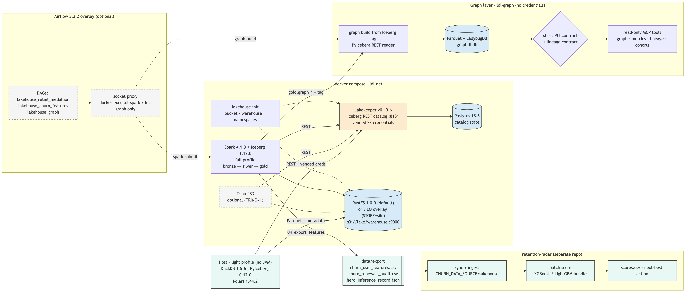
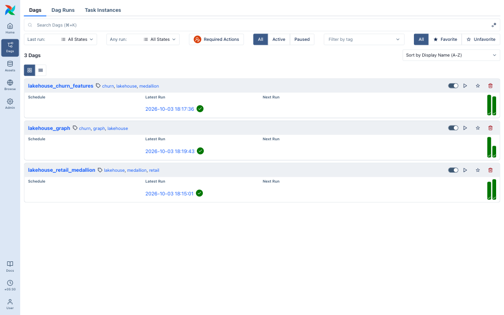
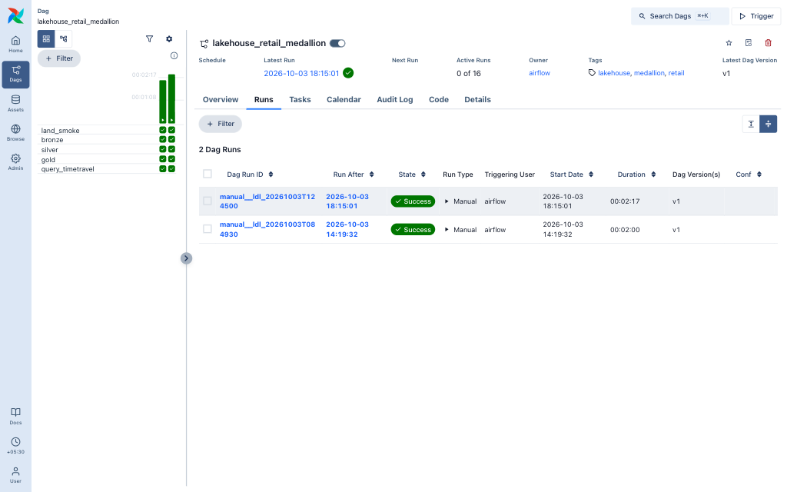
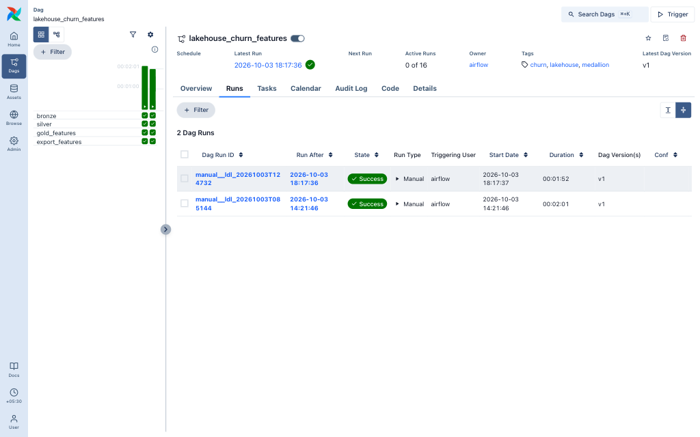
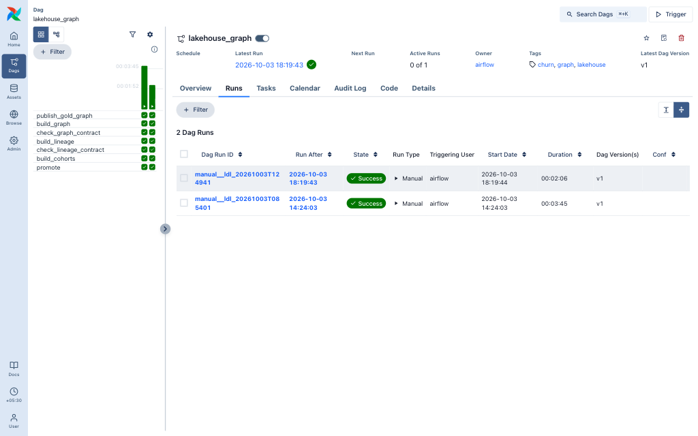

# Results: the local-first stack, end to end

One scripted run from empty volumes (`make purge` first), with every step's console output committed as an excerpt under [docs/demo/](docs/demo/README.md). Every number on this page comes from those excerpts, from [docs/graph/results/](docs/graph/results/index.md) or from the linked CI logs. Nothing was re-typed from memory.

| | |
|---|---|
| Date | 2026-10-02 (IST) |
| Code under test | `7f5fc43` on `feat/local-first-stack-2026` (later commits on the branch are docs, evidence tooling, the radar-main switch `9a7367d` and diagrams) |
| Machine | MacBook Pro, Apple M1 Pro, 16 GB, macOS 26.6.2; Docker Desktop 29.8.1 (VM 10 CPUs / 7.65 GiB), Compose 5.5.1 |
| Stack | Postgres 18.6 · Lakekeeper v0.13.6 (Iceberg REST) · RustFS 1.0.0 · lakehouse-init (curl 8.22.0) · Spark 4.1.3 + Iceberg 1.12.0 · Trino 483 · Airflow 3.3.2 + socket proxy |
| Host engines | DuckDB 1.5.6 · PyIceberg 0.12.0 · Polars 1.44.2 (no JVM) |
| Graph layer | Python 3.12.9 · LadybugDB 0.21.2 · pandas 3.0.6 · networkx 3.7; Spark harness pyspark 4.1.3 |
| Consumer | retention-radar `65cab25` (radar PR #21, since squash-merged: same tree as radar `main` `7e3bec8`, which CI now uses), Python 3.12 |

Source: [docs/demo/architecture-e2e.mmd](docs/demo/architecture-e2e.mmd); palette and rules: [docs/diagrams.md](docs/diagrams.md).

## Start-up and memory per profile

Start-up is the `make` step's wall time to healthy (`docker compose up --wait`). Memory is the sum of `docker stats --no-stream` for the stack's containers ([stack-up.excerpt.md](docs/demo/stack-up.excerpt.md)).

| Profile | Start-up | Memory |
|---|---:|---|
| light (Postgres, Lakekeeper, RustFS, lakehouse-init) | 7.9 s | 222 MiB idle; 300 MiB after `make demo-light` |
| full (+ Spark 4.1.3) | 11.1 s | 304 MiB idle (Spark idles between `spark-submit` runs) |
| full + graph overlay (`ldl-graph`) | in `make graph-e2e` | 518 MiB after `make graph-e2e` |
| full + trino (+ Trino 483) | in `make test-t3` | 1,536 MiB after `make test-t3` (Trino 951 MiB) |
| Airflow 3.3.2 overlay | 30.3 s | Airflow services 875 MiB; whole stack 2,413 MiB 20 s after start, 2,246 MiB after the three DAG runs |

SILO (`STORE=silo`) was not part of this run.

## Tests

| Tier | Result | Excerpt |
|---|---|---|
| T0 `make test-t0` (unit + static, no Docker) | 19 passed in 0.94 s | [tests.excerpt.md](docs/demo/tests.excerpt.md) |
| T1 `make test-t1` (REST catalog contract, testcontainers) | 5 passed in 6.20 s | [tests.excerpt.md](docs/demo/tests.excerpt.md) |
| T2 `make test-t2` (light-profile smoke) | 6 passed in 2.30 s | [tests.excerpt.md](docs/demo/tests.excerpt.md) |
| T3 `make test-t3` (Spark + Trino vs DuckDB / PyIceberg / Polars) | 7 passed in 186.83 s; max Spark vs pandas difference 1e-4 (`accept_rate_change`) | [tests.excerpt.md](docs/demo/tests.excerpt.md) |
| retention-radar `pytest` on the consumer checkout | 96 passed in 39.58 s | [radar-consume.excerpt.md](docs/demo/radar-consume.excerpt.md) |
| Graph suite (CI, Linux) | 1,386 passed, 0 failed, 37 skipped | [CI graph job](https://github.com/santoshshinde2012/local-data-lakehouse/actions/runs/37045405169/job/110965485794) |

## End-to-end steps

Every step exited 0.

| Step | Time | Result | Excerpt |
|---|---:|---|---|
| `make purge` → `make up-light` | 0.4 s + 7.9 s | light stack healthy | [stack-up.excerpt.md](docs/demo/stack-up.excerpt.md) |
| `make test-t1` / `make test-t2` | 6.8 s / 5.0 s | 5 passed / 6 passed | [tests.excerpt.md](docs/demo/tests.excerpt.md) |
| `make demo-light` | 4.8 s | retail 22 → 19 and time travel in 3 engines; churn twin 8,001 renewals | [light-demo.excerpt.md](docs/demo/light-demo.excerpt.md) |
| `make up-full` | 11.1 s | Spark 4.1.3 + Iceberg 1.12.0 healthy | [stack-up.excerpt.md](docs/demo/stack-up.excerpt.md) |
| `make e2e` (retail) | 95.6 s | bronze 22 → silver 19, gold 2 days, snapshot log + time travel | [retail-e2e.excerpt.md](docs/demo/retail-e2e.excerpt.md) |
| `make churn-sample` | 2.0 s | 8,001 subscriptions, 176,217 usage rows | [churn-e2e.excerpt.md](docs/demo/churn-e2e.excerpt.md) |
| `make churn-e2e` | 83.1 s | 8,001 renewals; 7,387 routed to the model; 3 exports | [churn-e2e.excerpt.md](docs/demo/churn-e2e.excerpt.md) |
| `make churn-parity` | 14.6 s | 8,001 × 27 match (Spark SQL vs pandas) | [churn-parity.excerpt.md](docs/demo/churn-parity.excerpt.md) |
| `pipelines/radar_consume.sh` | 66.6 s | 7,387 rows scored | [radar-consume.excerpt.md](docs/demo/radar-consume.excerpt.md) |
| radar `pytest` | 40.8 s | 96 passed | [radar-consume.excerpt.md](docs/demo/radar-consume.excerpt.md) |
| `make graph-e2e` (Docker, REST) | 103.5 s | publish → Iceberg build → strict contract → lineage → cohorts → promote | [graph-e2e.excerpt.md](docs/demo/graph-e2e.excerpt.md) |
| `make churn-gold-local` | 3.7 s | pandas twin export (7,387 rows), export contract OK | [churn-e2e.excerpt.md](docs/demo/churn-e2e.excerpt.md) |
| `make graph-local PROFILE=default` (strict) | 13.8 s | 40,204 nodes / 130,366 edges, golden s42 | [graph-e2e.excerpt.md](docs/demo/graph-e2e.excerpt.md) |
| `make test-t3` (+ Trino 483) | 203.5 s | 7 passed | [tests.excerpt.md](docs/demo/tests.excerpt.md) |
| `make test-t0` | 1.3 s | 19 passed | [tests.excerpt.md](docs/demo/tests.excerpt.md) |
| `make airflow-up` | 30.3 s | 3 DAGs parse, 0 import errors | [airflow-e2e.excerpt.md](docs/demo/airflow-e2e.excerpt.md) |
| `make airflow-demo` | 214.8 s | `lakehouse_retail_medallion` 5/5 and `lakehouse_churn_features` 4/4 tasks success | [airflow-e2e.excerpt.md](docs/demo/airflow-e2e.excerpt.md) |
| `lakehouse_graph` DAG | 132.3 s | 7/7 tasks success | [airflow-e2e.excerpt.md](docs/demo/airflow-e2e.excerpt.md) |
| `make down` | | containers removed, 4 volumes kept | |

## Pipeline numbers

**Retail medallion** ([retail-e2e.excerpt.md](docs/demo/retail-e2e.excerpt.md)):
- bronze `orders_raw` 22 rows → silver `orders` 19 (o-1003 / o-1006 deduped, pending dropped);
- gold `daily_order_metrics`: 2024-03-01 had 10 orders and revenue 424.94; 2024-03-02 had 9 orders and revenue 537.94;
- time travel to the day-1 snapshot reads 10 rows, against 22 now.

**Churn features** ([churn-e2e.excerpt.md](docs/demo/churn-e2e.excerpt.md)):

| Item | Value |
|---|---|
| Sample (seed 42) | 8,001 subscriptions, 176,217 usage rows, 10,602 limit events, 50,748 invoices, 2,134 tickets |
| Gold routes | `model` 7,387 (6,839 renewed, 548 voluntary lapse), `dunning` 326, `cancel_flow` 287, `score_today` 1 |
| Exports | `churn_user_features.csv` 7,387 renewals (voluntary-lapse rate 0.074); `churn_renewals_audit.csv` 8,001; `hero_inference_record.json` (sub_maya) |

**Parity** ([churn-parity.excerpt.md](docs/demo/churn-parity.excerpt.md)): Spark SQL gold and the pandas twin match on 8,001 renewals × 27 columns. The 2 `accept_rate_change` cells that Spark `bround` and numpy round differently agree within 1e-4.

**Retention Radar consumes the export** ([radar-consume.excerpt.md](docs/demo/radar-consume.excerpt.md); write-up on the radar side: [docs/e2e/lakehouse-consume.md](https://github.com/santoshshinde2012/retention-radar/blob/de7d35eef8e2b5f094fe348958841172e069fe24/docs/e2e/lakehouse-consume.md)): radar loaded 7,387 rows (churn rate 0.074) and scored all of them.

| Action | Rows |
|---|---:|
| `no_action` | 6,499 |
| `cancel_flow_discount` | 410 |
| `limit_reset` | 276 |
| `pause_offer` | 111 |
| `holdout` | 87 |
| `personal_email` | 4 |

`auto_action` was `none` for every row. After radar #21 merged, the script was re-run against radar `main` `7e3bec8`: 7,387 rows scored, with the same counts.

## Graph layer

Full record: [docs/graph/results/index.md](docs/graph/results/index.md) (commit `2ad9612`, 15 pass, 0 fail, 2 not run or not available).

- **Graph contracts:** tiny build 616 nodes / 1,949 edges; s42 and default builds 40,204 nodes / 130,366 edges. All strict, with point-in-time parity 0 mismatches × 6 features (pandas and Cypher).
- **Agent tools:** tiny 61/61 checks; s42 97/97 (275.4 s). The macOS sandbox check passed 47/47.
- **Spark SQL twin parity:** tiny in 24.38 s (1,182 SIMILAR_TO edges identical); s42 in 74.51 s (80,010 edges identical).
- **Lineage contract:** 30 gold SQL columns resolve; 20 of 22 features compliant, with 2 declared exceptions.
- **Cohorts:** leiden and louvain each found 15 cohorts (modularity 0.8056 / 0.8065).
- **Docker run:** the Iceberg-sourced build and its strict contract ran in `ldl-graph` ([docker-e2e.md](docs/graph/results/docker-e2e.md)).
- **Not covered:** there is no LLM eval report.

## Airflow 3 UI

Headless Playwright screenshots of the runs above ([airflow-e2e.excerpt.md](docs/demo/airflow-e2e.excerpt.md)):

| DAG list | Retail medallion |
|---|---|
|  |  |
| **Churn features** | **Graph** |
|  |  |

## CI

All jobs succeeded on every run below. PR #13 was squash-merged into `main` as `08bb274`.

| Head | Run | t0-unit | t2-light | t3-full | graph |
|---|---|---|---|---|---|
| `main` `08bb274` (PR #13 merged) | [37046795038](https://github.com/santoshshinde2012/local-data-lakehouse/actions/runs/37046795038) | [2 min 30 s](https://github.com/santoshshinde2012/local-data-lakehouse/actions/runs/37046795038/job/110970109891): radar ref `main`, commit `7e3bec8`, 7,387 rows scored | [52 s](https://github.com/santoshshinde2012/local-data-lakehouse/actions/runs/37046795038/job/110970110165) | [5 min 24 s](https://github.com/santoshshinde2012/local-data-lakehouse/actions/runs/37046795038/job/110970110261) | [18 min 36 s](https://github.com/santoshshinde2012/local-data-lakehouse/actions/runs/37046795038/job/110970110148): 1,386 passed, 37 skipped |
| `2e1d075` (radar consumer on radar `main`) | [37045405169](https://github.com/santoshshinde2012/local-data-lakehouse/actions/runs/37045405169) | [2 min 31 s](https://github.com/santoshshinde2012/local-data-lakehouse/actions/runs/37045405169/job/110965485307): radar ref `main`, commit `7e3bec8`, 7,387 rows scored | [53 s](https://github.com/santoshshinde2012/local-data-lakehouse/actions/runs/37045405169/job/110965485753) | [5 min 38 s](https://github.com/santoshshinde2012/local-data-lakehouse/actions/runs/37045405169/job/110965485808) | [18 min 20 s](https://github.com/santoshshinde2012/local-data-lakehouse/actions/runs/37045405169/job/110965485794): 1,386 passed, 37 skipped |
| `526f856` (evidence) | [37033594208](https://github.com/santoshshinde2012/local-data-lakehouse/actions/runs/37033594208) | [1 min 59 s](https://github.com/santoshshinde2012/local-data-lakehouse/actions/runs/37033594208/job/110926629366) | [2 min 2 s](https://github.com/santoshshinde2012/local-data-lakehouse/actions/runs/37033594208/job/110926629309) | [5 min 22 s](https://github.com/santoshshinde2012/local-data-lakehouse/actions/runs/37033594208/job/110926629393) | [20 min 1 s](https://github.com/santoshshinde2012/local-data-lakehouse/actions/runs/37033594208/job/110926629107) |

retention-radar:

| Run | Jobs |
|---|---|
| PR #21 on `65cab25` | [run 37019854227](https://github.com/santoshshinde2012/retention-radar/actions/runs/37019854227): `test` and `e2e-local` succeeded |
| `main` `7e3bec8` after the merge | [run 37029880425](https://github.com/santoshshinde2012/retention-radar/actions/runs/37029880425): both succeeded |
| PR #22 (this write-up onto `main`) | [run 37044528066](https://github.com/santoshshinde2012/retention-radar/actions/runs/37044528066): both succeeded |

## Known gaps

- **Strict default graph contract:** run `make churn-gold-local` first. Against a Spark-written export it fails on the 2 rounding cells above ([lakehouse-twin.md](docs/graph/lakehouse-twin.md#why-gold-drifts-by-1e-4-in-two-cells)).
- **Radar drift check:** radar's `feature_stats.json` has no `psi_bins`, so the check falls back to SMD.
- **Lineage golden:** the `core.json` input hashes predate this branch's script edits. They are informational; the contract passes.
