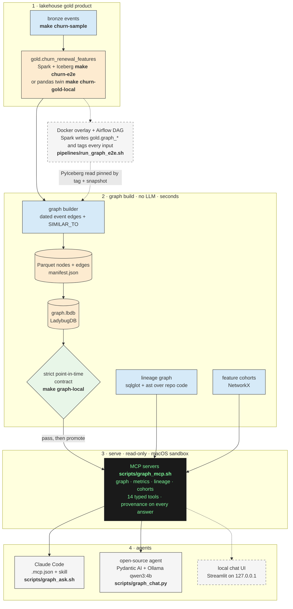

# Graph on gold

A small, deterministic graph built from the churn gold and silver tables, a contract that keeps it
point-in-time correct, and read-only MCP tools that let an agent cite what the renewal model could see at
T-7, show similar past renewals with their outcomes, count the blast radius of global events, and answer
lineage questions about the pipeline itself. It adds explanation and provenance, not prediction.

> **TEACHING-ONLY. NOT PRODUCTION.** The data is synthetic. The MCP servers run locally over stdio with no
> authentication. `read_only` is not a sandbox; the OS sandbox is macOS only. Approving `.mcp.json` runs
> repo code on your machine. Only `scripts/graph_ask.sh` limits Claude Code to the lakehouse servers. The
> Claude path is not fully open source. Similarity is not causation, and no tool produces a risk score.
> Full banner and threat model: [agent.md](agent.md).

Checked 2026-10-01 on macOS arm64 (seed 42, `N_USERS=8000`) by `scripts/graph_evidence.py`; the output of
every check is in [results/index.md](results/index.md). The table is generated from the builds:

<!-- graph-evidence:begin summary:headline -->
| | Seed 42 (`s42`) | Tiny fixture (`tiny`) |
|---|---:|---:|
| Nodes / edges | 40,204 / 130,366 | 616 / 1,949 |
| Strict contract | pass (strict) | pass (strict) |
| Point-in-time parity (6 features, pandas and Cypher) | 0 mismatches | 0 mismatches |
| A naive traversal must be wrong (limit hits / incident exposure / tickets) | 1,165 / 681 / 114 | 16 / 12 / 4 |
| Event edges after their renewal's as_of (kept on purpose, never served) | 14,862 of 34,348 | 235 of 519 |
| Build (builder + Ladybug load, max RSS) | 4.1 s + 1.1 s, 309 MiB | 0.2 s + 0.6 s, 128 MiB |
| Tools (warm p95 over MCP stdio, 20 calls each) | graph tools at most 25.5 ms; all 14 tools at most 30.5 ms | not measured |

<sub>Generated by `scripts/graph_charts.py` from each build's `manifest.json` and `contract.json` (s42 build `28f3af496493`, tiny build `10ea18b83bbc`; commit `d317368` with uncommitted changes) and `results/tools-bench-s42.json`.</sub>
<!-- graph-evidence:end summary:headline -->

## Architecture

From the renewal gold to an agent answer. The detailed build, serve and lakehouse diagram, the build
profiles and the directory layout are in [architecture.md](architecture.md).



Dashed boxes are optional paths (Docker) or still being finished (the local UI).

## Quickstart (no Docker)

```bash
make graph-venv                       # Python 3.12 venv from the hash-locked requirements-graph.txt
make graph-sample PROFILE=s42         # seed 42 bronze + exports under data/graph/s42 (data/sample untouched)
make graph-local PROFILE=s42          # build + strict contract + repo contracts
make graph-local && make graph-promote   # the default profile (data/sample/churn; run make churn-gold-local first)
.venv-graph/bin/python scripts/build_lineage_local.py --graph-profile default
.venv-graph/bin/python scripts/build_graph_cohorts.py --profile default
```

Then start Claude Code in the repo root and approve the project servers in `.mcp.json`, or run
`scripts/graph_ask.sh "What could the model see about Maya at T-7?"`. Every target and command:
[operations.md](operations.md).

## Pages

| Page | What it covers |
|---|---|
| [architecture.md](architecture.md) | build, serve and lakehouse modes; profiles; build identity; directory layout; code map |
| [data-model.md](data-model.md) | nodes, edges, SIMILAR_TO, point-in-time rules, the contract, goldens, provenance |
| [agent.md](agent.md) | the four MCP servers and 14 tools, the envelope, hygiene, routing, the Claude and open-source paths, the threat model |
| [lineage.md](lineage.md) | the Tier-0 lineage graph, its tools and contract, the repo defects it found |
| [lakehouse-twin.md](lakehouse-twin.md) | Spark + Iceberg twin with tags, PyIceberg safety, Docker overlay, Airflow DAG, parity, the export fix, the gold rounding finding |
| [evaluation.md](evaluation.md) | what the graph shows (charts), what it does not add, the agent eval design |
| [operations.md](operations.md) | Make targets, RAM and modes, housekeeping, goldens, upgrades, troubleshooting, Docker cleanup |
| [research.md](research.md) | findings, decisions, rejected options, licences, honesty notes, sources |
| [results/index.md](results/index.md) | the latest output of every check, with provenance headers |
| [../demo/graph-e2e.excerpt.md](../demo/graph-e2e.excerpt.md) | a verified run, from `graph-sample` to tool calls |

## Status

What exists and passes, what exists and fails, and what is not built yet (2026-10-01).

| Part | State | Evidence |
|---|---|---|
| Business graph, contract, goldens, profiles (`make graph-*`) | **built, passing**: strict contract on tiny, s42 and default | [results](results/index.md) |
| Repo contracts (constants, columns, appName, LEAKY) | **built, passing** (0 errors, 2 known warnings) | [repo-contracts.md](results/repo-contracts.md) |
| Agent surface: 4 MCP servers, 14 tools, envelope, audit log, `.mcp.json`, skill, `graph_ask.sh` | **built, passing** (tools check on tiny and s42, MCP smoke in both protocols) | [graph-tools-s42.md](results/graph-tools-s42.md) |
| macOS sandbox around the servers | **built, passing** when run alone; its unified-log step can fail while other sandboxed processes run | [sandbox-check.md](results/sandbox-check.md) |
| Tier-0 lineage graph and tools | **built; strict contract failing** on `d317368` (the CI clone line) | [lineage.md](lineage.md#known-issue-the-ci-clone-line) |
| Feature cohorts, Cytoscape.js evidence views | **built, passing** (outside the contract) | [cohorts.md](results/cohorts.md) |
| Spark SQL twin, Iceberg tags, PyIceberg reader, source-aware contract | **built, passing** (parity exact on tiny and s42) | [graph-parity-s42.md](results/graph-parity-s42.md) |
| Docker overlay, `run_graph_e2e.sh`, Airflow DAG | **built; recorded run partial**: every step passes except the lineage contract on `d317368` | [docker-e2e.md](results/docker-e2e.md) |
| Export fix in `src/jobs/churn/04_export_features.py` | **applied** (a user file: review) | [lakehouse-twin.md](lakehouse-twin.md#the-export-fix-04_export_featurespy) |
| These docs, charts and the evidence runner | **built** | `scripts/graph_evidence.py`, `scripts/graph_charts.py` |
| Agent eval (40 cases, R / M / SE / H arms), replay test, leakage demo, bench script | **not built** | [evaluation.md](evaluation.md#agent-eval) |
| Open-source agent (Pydantic AI + Ollama), chat CLI, local UI, `graph-demo` | **not built** (researched) | [agent.md](agent.md#the-open-source-path) |
| Guarded raw Cypher (`--enable-cypher`) | **not built** (the server refuses the flag) | |
| Tier-1 Iceberg lineage facts, OpenLineage loader | **not built** (schema placeholders) | [lineage.md](lineage.md#tiers) |
| Make targets beyond the Phase 1 set, CI `graph` job, `pytest.ini` | **not added** | [operations.md](operations.md#make-targets) |
| Repo README section + banner, `config/CATALOG.md` refresh, `docs/demo/README.md` entry | **not done** (files outside this docs folder) | |
| Linux validation of ladybug 0.21.1 | **not run** (no CI job yet) | |

Open findings worth fixing first: the lineage extractor and the CI clone line; one population-template
encoding the leak lint does not catch (the served templates are safe, [data-model.md](data-model.md#point-in-time-rules));
the sandbox check's unified-log step is not filtered by process; two minor `iceberg_source.py` review
findings ([lakehouse-twin.md](lakehouse-twin.md#not-done-yet)).

## Regenerating these docs

```bash
.venv-graph/bin/python scripts/graph_evidence.py --graph-root data/graph   # runs the checks, writes results/, img/
.venv-graph/bin/python scripts/graph_charts.py --profile s42 --docs-dir docs/graph   # charts and generated regions only
.venv-graph/bin/python scripts/graph_charts.py --profile s42 --docs-dir docs/graph --check   # exit 1 if anything is stale
```

There is no `make graph-evidence` target yet ([operations.md](operations.md#make-targets)). `graph_charts.py`
reads the tool bench from `results/tools-bench-s42.json` (written by `graph_evidence.py`) unless
`--tools-json` names another file. Everything between a `graph-evidence:begin` and a `graph-evidence:end`
HTML comment in these pages is generated; edit the text around it. Charts are SVG, drawn twice (light and
dark), from the builds and results files only.
