# Graph on gold

A small, deterministic graph built from the churn gold and silver tables, a contract that keeps it
point-in-time correct, and read-only MCP tools that let an agent cite what the renewal model could see at
T-7, show similar past renewals with their outcomes, count the blast radius of global events, and answer
lineage questions about the pipeline itself. It adds explanation and provenance, not prediction.

> **TEACHING-ONLY. NOT PRODUCTION.** The data is synthetic. The MCP servers run locally over stdio with no
> authentication. `read_only` is not a sandbox; the OS sandbox is macOS only. Approving `.mcp.json` runs
> repo code on your machine. Only `scripts/graph_ask.sh` limits Claude Code to the lakehouse servers. The
> Claude path is not fully open source. Similarity is not causation, and no tool produces a risk score.
> Full banner and threat model: [agent.md](agent.md).

Checked 2026-10-02 on macOS arm64 on the local-first stack (seed 42, `N_USERS=8000`, commit `6225473`) by `scripts/graph_evidence.py`; the output of
every check is in [results/index.md](results/index.md). The table is generated from the builds:

<!-- graph-evidence:begin summary:headline -->
| | Seed 42 (`s42`) | Tiny fixture (`tiny`) |
|---|---:|---:|
| Nodes / edges | 40,204 / 130,366 | 616 / 1,949 |
| Strict contract | pass (strict) | pass (strict) |
| Point-in-time parity (6 features, pandas and Cypher) | 0 mismatches | 0 mismatches |
| A naive traversal must be wrong (limit hits / incident exposure / tickets) | 1,165 / 681 / 114 | 16 / 12 / 4 |
| Event edges after their renewal's as_of (kept on purpose, never served) | 14,862 of 34,348 | 235 of 519 |
| Build (builder + Ladybug load, max RSS) | 4.2 s + 1.1 s, 320 MiB | 0.2 s + 0.6 s, 130 MiB |
| Tools (warm p95 over MCP stdio, 20 calls each) | graph tools at most 17.7 ms; all 14 tools at most 28.3 ms | not measured |

<sub>Generated by `scripts/graph_charts.py` from each build's `manifest.json` and `contract.json` (s42 build `a2598a28e164`, tiny build `6c8fea296d84`; commit `013dd4e`) and `results/tools-bench-s42.json`.</sub>
<!-- graph-evidence:end summary:headline -->

## Architecture

From the renewal gold to an agent answer. The detailed build, serve and lakehouse diagram, the build
profiles and the directory layout are in [architecture.md](architecture.md).

```mermaid
%%{init: {"theme": "base", "flowchart": {"wrappingWidth": 360}, "themeVariables": {"primaryColor": "#CCFBF1", "primaryTextColor": "#0F172A", "primaryBorderColor": "#0F766E", "lineColor": "#64748B", "textColor": "#0F172A", "edgeLabelBackground": "#FFFFFF", "clusterBkg": "#FFFFFF", "clusterBorder": "#64748B", "titleColor": "#0F172A", "attributeBackgroundColorOdd": "#FFFFFF", "attributeBackgroundColorEven": "#F0FDFA", "relationColor": "#64748B", "relationLabelBackground": "#FFFFFF", "relationLabelColor": "#0F172A"}}}%%
flowchart LR
  subgraph LAKE["1 · lakehouse gold product"]
    direction TB
    BR["bronze events<br/>make churn-sample"] --> GD["gold.churn_renewal_features<br/>Spark + Iceberg: make churn-e2e<br/>or pandas twin: make churn-gold-local"]
  end

  subgraph BUILD["2 · graph build · no LLM · seconds"]
    direction TB
    GB["graph builder<br/>dated event edges + SIMILAR_TO"] --> PQ[("Parquet nodes + edges<br/>manifest.json")] --> LB[("graph.lbdb<br/>LadybugDB")] --> CK{"strict point-in-time<br/>contract<br/>make graph-local"}
    LX["lineage graph<br/>sqlglot + ast over repo code"]
    CO["feature cohorts<br/>NetworkX"]
  end

  subgraph SERVE["3 · serve · read-only · macOS sandbox"]
    MCP["MCP servers: scripts/graph_mcp.sh<br/>graph · metrics · lineage · cohorts<br/>14 typed tools · provenance on every answer"]
  end

  subgraph AGENTS["4 · agents"]
    direction TB
    CC["Claude Code<br/>.mcp.json + skill<br/>scripts/graph_ask.sh"]
    OSS["open-source agent, experimental<br/>Pydantic AI + Ollama qwen3:4b<br/>scripts/graph_chat.py"]
  end

  TWIN["Docker overlay + Airflow DAG<br/>Spark writes gold.graph_* and tags every input<br/>make graph-e2e"]

  GD --> GB
  GD -.-> TWIN
  TWIN -.->|"PyIceberg REST read pinned by tag + snapshot"| GB
  CK -->|"pass, then promote"| MCP
  LX --> MCP
  CO --> MCP
  MCP --> CC
  MCP --> OSS

  classDef storage fill:#DBEAFE,stroke:#1D4ED8,color:#0F172A,stroke-width:1.5px
  classDef catalog fill:#FEF3C7,stroke:#B45309,color:#0F172A,stroke-width:1.5px
  classDef compute fill:#ECFCCB,stroke:#4D7C0F,color:#0F172A,stroke-width:1.5px
  classDef orchestration fill:#FCE7F3,stroke:#BE185D,color:#0F172A,stroke-width:1.5px
  classDef graphlayer fill:#CCFBF1,stroke:#0F766E,color:#0F172A,stroke-width:1.5px
  classDef consumer fill:#FFEDD5,stroke:#C2410C,color:#0F172A,stroke-width:1.5px
  classDef data fill:#F1F5F9,stroke:#475569,color:#0F172A,stroke-width:1.5px
  class BR,GD data
  class GB,PQ,LB,CK,LX,CO graphlayer
  class MCP,CC,OSS consumer
  class TWIN orchestration
  style TWIN stroke-dasharray:5 5
  style OSS stroke-dasharray:5 5
```



Dashed borders mark optional (Docker) or experimental (the local-model agent) parts; colours follow the [diagram palette](../diagrams.md). There is no chat UI.

## Quickstart (no Docker)

```bash
make graph-venv                       # Python 3.12 venv from the hash-locked requirements-graph.txt
make graph-sample PROFILE=s42         # seed 42 bronze + exports under data/graph/s42 (data/sample untouched)
make graph-local PROFILE=s42          # build + strict contract + repo contracts
make graph-local && make graph-promote   # the default profile (data/sample/churn; run make churn-gold-local first)
.venv-graph/bin/python scripts/build_lineage_local.py --graph-profile default
.venv-graph/bin/python scripts/build_graph_cohorts.py --profile default
```

Then start Claude Code in the repo root and approve the project servers in `.mcp.json`, or run
`scripts/graph_ask.sh "What could the model see about Maya at T-7?"`. Every target and command:
[operations.md](operations.md).

## Pages

| Page | What it covers |
|---|---|
| [architecture.md](architecture.md) | build, serve and lakehouse modes; profiles; build identity; directory layout; code map |
| [data-model.md](data-model.md) | nodes, edges, SIMILAR_TO, point-in-time rules, the contract, goldens, provenance |
| [agent.md](agent.md) | the four MCP servers and 14 tools, the envelope, hygiene, routing, the Claude and open-source paths, the threat model |
| [lineage.md](lineage.md) | the Tier-0 lineage graph, its tools and contract, the repo defects it found |
| [lakehouse-twin.md](lakehouse-twin.md) | Spark + Iceberg twin with tags, PyIceberg safety, Docker overlay, Airflow DAG, parity, the export fix, the gold rounding finding |
| [evaluation.md](evaluation.md) | what the graph shows (charts), what it does not add, the agent eval design |
| [operations.md](operations.md) | Make targets, RAM and modes, housekeeping, goldens, upgrades, troubleshooting, Docker cleanup |
| [research.md](research.md) | findings, decisions, rejected options, licences, honesty notes, sources |
| [results/index.md](results/index.md) | the latest output of every check, with provenance headers |
| [../demo/graph-e2e.excerpt.md](../demo/graph-e2e.excerpt.md) | a verified run, from `graph-sample` to tool calls |

## Status

What exists and passes, what exists and fails, and what is not built (updated 2026-10-02, branch
`feat/local-first-stack-2026`). The generated results under [results/](results/index.md) were
regenerated on 2026-10-02 on the REST-catalog stack (15 pass, 0 fail; the Iceberg-sourced build is
checked in its container, the eval needs an LLM run).

| Part | State | Evidence |
|---|---|---|
| Business graph, contract, goldens, profiles (`make graph-*`) | **built, passing**: strict contract on tiny, s42 and default | [results](results/index.md) |
| Repo contracts (constants, columns, appName, LEAKY) | **built, passing** (0 errors, 2 known warnings) | [repo-contracts.md](results/repo-contracts.md) |
| Agent surface: 4 MCP servers, 14 tools, envelope, audit log, `.mcp.json`, skill, `graph_ask.sh` | **built, passing**: tools check 61/61 on tiny and 97/97 on s42 (2026-10-02) | [graph-tools-s42.md](results/graph-tools-s42.md) |
| macOS sandbox around the servers | **built, passing** when run alone; its unified-log step can fail while other sandboxed processes run | [sandbox-check.md](results/sandbox-check.md) |
| Tier-0 lineage graph and tools | **built, passing**: the lineage contract passes again (the CI clone line is resolved) | [lineage.md](lineage.md#known-issue-the-ci-clone-line) |
| Tier-1 Iceberg lineage facts (`build_lineage_local.py --iceberg`) | **built**; reads snapshots and refs through the REST catalog (2026-10-02) | [lineage.md](lineage.md#tiers) |
| Feature cohorts, Cytoscape.js evidence views | **built, passing** (outside the contract) | [cohorts.md](results/cohorts.md) |
| Spark SQL twin, Iceberg tags, PyIceberg REST reader, source-aware contract | **built, passing** (parity exact on tiny (24.7 s) and s42 (68.2 s) on pyspark 4.1.3 + Iceberg 1.12.0, 2026-10-02) | [graph-parity-s42.md](results/graph-parity-s42.md) |
| Docker overlay, `make graph-e2e` / `run_graph_e2e.sh` | **built, passing** on the REST stack: `make graph-e2e` 103.5 s from empty volumes, `run_graph_e2e.sh` 87 s (2026-10-02) | [lakehouse-twin.md](lakehouse-twin.md#the-docker-run) |
| Airflow DAG `lakehouse_graph` | **built, passing** on Airflow 3.3.2: all 7 tasks `success` in 132 s (2026-10-02, [airflow excerpt](../demo/airflow-e2e.excerpt.md)) | [lakehouse-twin.md](lakehouse-twin.md#airflow) |
| Export fix in `src/jobs/churn/04_export_features.py` | **applied** | [lakehouse-twin.md](lakehouse-twin.md#the-export-fix-04_export_featurespy) |
| These docs, charts and the evidence runner | **built** | `scripts/graph_evidence.py`, `scripts/graph_charts.py` |
| Open-source agent: Pydantic AI harness (`src/lakehouse_graph/agent.py`), chat CLI (`scripts/graph_chat.py`) | **built, experimental**: local model `qwen3:4b` through Ollama; own venv (`requirements-graph-eval.txt`); unit-tested without a model (`tests/graph/test_agent.py`) | [agent.md](agent.md#the-open-source-path) |
| Agent eval (`scripts/graph_eval.py`, 40 cases in `evals/graph_cases.yaml`), replay test, leakage demo, bench script | **built**; CI runs only the deterministic replay test; no model-graded report is published | [evaluation.md](evaluation.md#agent-eval) |
| Local chat UI | **not built** (no Streamlit or other UI in the repo) | |
| Guarded raw Cypher (`scripts/graph_mcp.sh --enable-cypher`, `cypher_guard.py`) | **built, opt-in**: served alone and only under the macOS sandbox | [agent.md](agent.md) |
| OpenLineage loader (Tier 2) | **not built** | [lineage.md](lineage.md#tiers) |
| CI `graph` job | **added** (graph tests + tiny build and strict contract) | `.github/workflows/ci.yml` |
| Linux validation | **run in CI** (`graph` job on ubuntu-latest, PR #13): the 18 known failures and one shellcheck finding are fixed | `.github/workflows/ci.yml` |

`make graph-test` on 2026-10-02 (macOS arm64, ladybug 0.21.2, sqlglot 30.21.0): 1,391 passed, 0 failed,
32 skipped in 12 min; `make graph-sample PROFILE=tiny && make graph-local PROFILE=tiny` passes the strict
contract. The 18 disclosure / evidence failures that were also on `origin/main` are fixed, none by
loosening suppression (the rules are in [agent.md](agent.md#output-hygiene-and-small-cells)):

- the exact check missed pins that follow from the published equations alone (a null equal to a printed
  total minus printed zeros), so it left computable nulls; it now proves them by linear span, and a
  pinned margin over a null 0 or a pinned tied numerator gets a complement;
- the adversary in `scripts/check_graph_tools.py` counted the current (public by design) cells, and plan
  rows made only of them, as small-cell disclosures;
- tests had drifted from the API (`Protected.withheld` is a set of groups, a cap-hit filter selects one
  band) and from the shared publication (two tiny pins are now null together);
- `scripts/graph_evidence.py` recorded a measurement script's "SKIP: no build" (exit 3) as FAIL; it
  is "not run" now;
- the "no renewal matches" caveat of `metric_lapse_rate` could give a null 0 back; it is said only of
  a printed 0.

The Spark harness tests need `.venv-graph-spark` and are skipped by `make graph-test`; run with that
venv they pass (pyspark 4.1.3). Open findings worth fixing first: one
population-template encoding the leak lint does not catch (the served templates are safe,
[data-model.md](data-model.md#point-in-time-rules)); the sandbox check's unified-log step is not
filtered by process.

## Regenerating these docs

```bash
.venv-graph/bin/python scripts/graph_evidence.py --graph-root data/graph   # runs the checks, writes results/, img/
.venv-graph/bin/python scripts/graph_charts.py --profile s42 --docs-dir docs/graph   # charts and generated regions only
.venv-graph/bin/python scripts/graph_charts.py --profile s42 --docs-dir docs/graph --check   # exit 1 if anything is stale
```

`make graph-evidence` runs the first command ([operations.md](operations.md#make-targets)). `graph_charts.py`
reads the tool bench from `results/tools-bench-s42.json` (written by `graph_evidence.py`) unless
`--tools-json` names another file. Everything between a `graph-evidence:begin` and a `graph-evidence:end`
HTML comment in these pages is generated; edit the text around it. Charts are SVG, drawn twice (light and
dark), from the builds and results files only.
