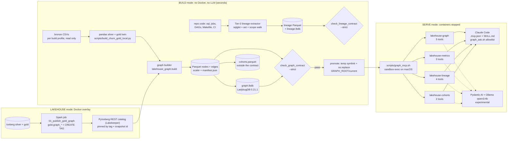

# Graph on gold: architecture

The renewal graph is a derived, audited view of the churn gold and silver tables. It is built
deterministically from the same pandas twin that writes the radar exports, stored as Parquet, projected
into an embedded graph engine (LadybugDB 0.21.1, MIT), checked by a contract, and served to agents by
read-only MCP tools. No LLM is involved in building it. No Docker is needed to build or serve it.

Status of every part: [README.md](README.md#status). Numbers below: seed 42, `N_USERS=8000`, graph
build `28f3af496493` (see [results/index.md](results/index.md)).

## The picture



Solid arrows exist and are tested. The dashed arrow is the fully open-source agent path: built
(`src/lakehouse_graph/agent.py`, `scripts/graph_chat.py`) but experimental, local only, and slow on a
thinking-only 4B model ([agent.md](agent.md#the-open-source-path)). There is no chat UI.

## Three modes

The host is a 16 GB laptop that swaps. The modes are scheduled, never run all at once
([operations.md](operations.md#ram-and-modes)).

| Mode | What runs | Docker | Entry point |
|---|---|---|---|
| BUILD | bronze CSV → pandas gold twin → Parquet → Ladybug → contract → lineage → cohorts → promote | no | `make graph-local PROFILE=...`, `make graph-promote` |
| SERVE | up to four stdio MCP servers over one promoted build, sandboxed on macOS | no | `.mcp.json` (Claude Code), `scripts/graph_mcp.sh` |
| LAKEHOUSE | Spark publishes `gold.graph_*` into Iceberg and tags every input; a Python container reads them back by tag and runs the same builder and contract | yes | `pipelines/run_graph_e2e.sh`, Airflow DAG `lakehouse_graph` ([lakehouse-twin.md](lakehouse-twin.md)) |

## Build profiles

A profile decides where the bronze comes from and where the build goes. A profile's seed is derived from
its name, so these four kinds are the only valid names. No graph target writes `data/sample/churn` or
`data/export`; the contract checks their sha256 before and after.

| Profile | Bronze read from | Exports cross-checked | May be promoted |
|---|---|---|---|
| `default` | `CHURN_SAMPLE_DIR` or `data/sample/churn` (read only) | `CHURN_EXPORT_DIR` or `data/export` (read only) | yes, with `make graph-promote` |
| `s<seed>` (e.g. `s42`) | `$GRAPH_ROOT/s<seed>/sample/` (made by `make graph-sample`) | `$GRAPH_ROOT/s<seed>/export/` | never |
| `tiny` | `data/sample/churn/fixtures/tiny` (committed, read only; seed 42, 120 users) | `$GRAPH_ROOT/tiny/export/` | never |
| `inject` | a copy of the tiny bronze with one poisoned `user_name` | `$GRAPH_ROOT/inject/export/` | never |

`make graph-sample` runs the user's generator and gold script unchanged, with their directories pointed
into the profile tree. The graph targets never chain the `churn-*` targets: those run the system
`python3` and rewrite the exports with a new `built_at`.

## Build directory

```text
$GRAPH_ROOT/                                  default: data/graph (gitignored)
  current -> default/builds/<id>              the promoted build (serve mode reads this, once)
  <profile>/latest -> builds/<id>
  <profile>/builds/<business_build_id>/
    parquet/nodes_<Label>.parquet             10 node tables
    parquet/edges_<TYPE>.parquet              11 edge tables
    similar_to_scaler.parquet                 the persisted z-score scaler (20 features)
    similar_to_cut.parquet                    each source's rank k+1 candidate (tie checks)
    graph.lbdb                                LadybugDB projection (rebuildable, never migrated)
    manifest.json                             identity, hashes, versions, seed, counts, provenance
    contract.json                             the last contract verdict
    lineage/ + lineage.lbdb                   the lineage graph (scripts/build_lineage_local.py)
    cohorts.parquet                           feature cohorts (scripts/build_graph_cohorts.py)
    .pids/<pid>.pid                           a live server holds this build (gc skips it)
  <profile>/{sample,export}/                  non-default profiles only
  logs/audit-<date>.jsonl                     one line per tool call, no argument values
  .lock  .audit_key
```

Parquet is canonical. `graph.lbdb` is a projection that is rebuilt on every engine bump. Rebuilds are
byte-identical on one platform; across platforms the contract is semantic.

## Identity and provenance

- **business_build_id**: the first 12 hex characters of sha256 over the sha256 of every bronze CSV, the
  sha256 of the code that shapes content (`scripts/build_churn_gold_local.py`,
  `scripts/build_graph_local.py`, `sql/churn/gold_renewal_features.sql`, and `__init__.py`, `spec.py`,
  `build.py`, `store.py`, `manifest.py` of `src/lakehouse_graph`), the spec versions, the SIMILAR_TO
  parameters, the ladybug / pyarrow / pandas / numpy versions and the platform tag. A change to the
  gold logic on the same bronze gives a new id.
- **lineage_build_id**: the same pattern over every file the lineage extractor reads (SQL, jobs, DAGs,
  scripts, Makefile, CI, README). It never changes the business id.
- **Iceberg-sourced builds** keep the bronze identity when their Parquet is byte-identical to the local
  path. Otherwise the id is computed over the Iceberg input pins (table, snapshot id) as well.
- `manifest.json` also records seed and `N_USERS` (`declared`, or `verified` when regenerated and
  compared), the commit and dirty flag, `data_end`, `synthetic: true`, the export sha256 and the guarded
  user files. Every tool answer carries a compact copy as `provenance` ([agent.md](agent.md#the-envelope)).

## Housekeeping

- **Lock**: `fcntl.flock` on `$GRAPH_ROOT/.lock`. Build, promote, gc and the contract's write of
  `contract.json` all take it (macOS has no `flock(1)`).
- **Promote**: a temp symlink plus `os.replace` onto `$GRAPH_ROOT/current`, only for a `default` build
  with a strict contract pass that is still fresh. `BUILD=<id>` rolls back to a named build.
- **Rebuild**: `make graph-build GRAPH_BUILD_FLAGS=--rebuild` swaps a new build over the old one in one
  atomic exchange (`renamex_np` on macOS, `renameat2` on Linux; a two-rename fallback otherwise). When
  the Parquet is byte-identical it carries over `contract.json`, the lineage (while fresh) and the
  cohorts (while their record matches).
- **GC**: `make graph-clean` keeps the newest 3 builds per profile and never removes a build that
  `current` or `latest` points at, or that a live server holds (pidfile plus `os.kill(pid, 0)`).
- **Serve pinning**: the launcher resolves `current` once to a real path. A swap during a session does
  not change what a running server serves; restart it to pick up a new build.

## Code map

| Path | Role |
|---|---|
| `src/lakehouse_graph/spec.py` | versions, node / edge schema, SIMILAR_TO spec, PIT windows, feature cards, paths |
| `src/lakehouse_graph/build.py` | pure node / edge / kNN builders, deterministic Parquet writer, `build_profile` |
| `src/lakehouse_graph/manifest.py` | identity, hashes, versions, seed status, git state |
| `src/lakehouse_graph/store.py` | Ladybug load / read-only open (capped pool, threads, timeout), lock, promote, gc |
| `src/lakehouse_graph/queries.py` | the vetted Cypher templates (ORDER BY + LIMIT) and the leak lint |
| `src/lakehouse_graph/oracle.py` | pandas golden answers and invariants; `--print-golden` |
| `src/lakehouse_graph/{envelope,context,search,tools,metrics,mcp_server}.py` | the agent surface ([agent.md](agent.md)) |
| `src/lakehouse_graph/lineage/` | Tier-0 lineage extractor, graph, oracle, tools ([lineage.md](lineage.md)) |
| `src/lakehouse_graph/cohorts.py`, `viz.py` | feature cohorts; Cytoscape.js evidence views (vendored, MIT) |
| `src/lakehouse_graph/iceberg_source.py` | PyIceberg reader pinned by tag + snapshot ([lakehouse-twin.md](lakehouse-twin.md)) |
| `src/lakehouse_graph/charts.py` | the SVG charts and Mermaid diagrams of these docs |
| `src/jobs/graph/01_publish_gold_graph.py`, `sql/graph/*.sql` | the Spark twin |
| `scripts/build_graph_local.py` | `build`, `sample`, `promote`, `gc`, `golden` |
| `scripts/check_graph_contract.py`, `check_lineage_contract.py`, `check_repo_contracts.py`, `check_graph_tools.py`, `check_graph_parity.py`, `graph_sandbox_check.py` | the checks |
| `scripts/graph_mcp.sh`, `graph_ask.sh`, `config/graph/sandbox.sb`, `.mcp.json`, `.claude/skills/lakehouse-graph/SKILL.md` | serving and the Claude path |
| `scripts/graph_evidence.py`, `graph_charts.py` | these docs' results and charts |
| `docker-compose.graph.yml`, `docker/graph/`, `pipelines/run_graph_e2e.sh`, `airflow/dags/lakehouse_graph*.py` | the lakehouse path |
| `tests/graph/` | pytest; tiny builds once per session, s42 tests are marked slow |

## Read next

[data-model.md](data-model.md) for what is in the graph and the rules that keep it point-in-time
correct; [agent.md](agent.md) for the tools and the threat model; [operations.md](operations.md) to
run it.
