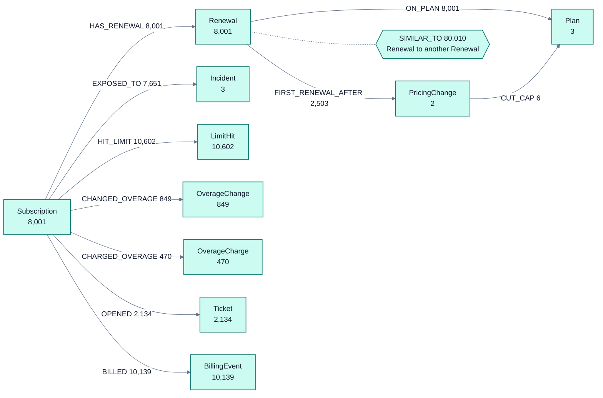
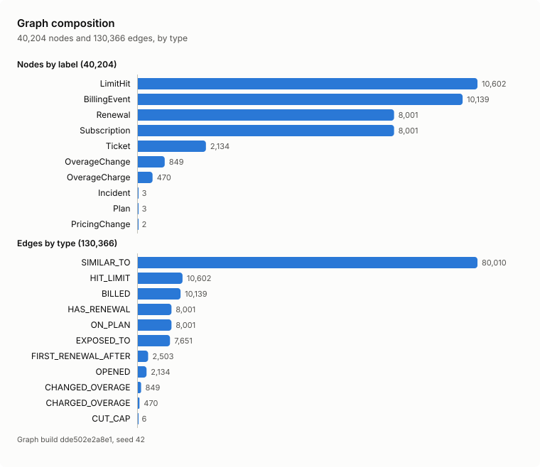
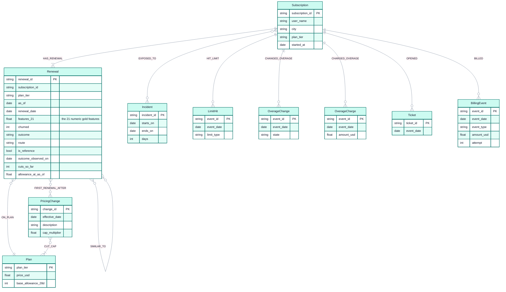
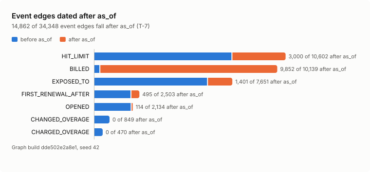
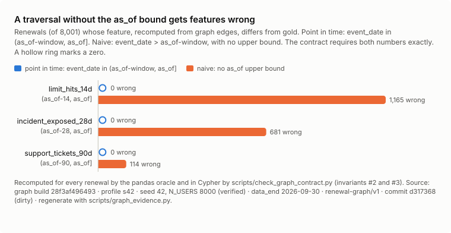

# Graph on gold: data model and contract

Spec `renewal-graph/v1` (nodes and edges) and `similar_to/renewal-v1` (the kNN edge), both in
`src/lakehouse_graph/spec.py`. Contract: `scripts/check_graph_contract.py --strict`, version
`renewal-graph/v1`. Checked 2026-10-02 · seed 42, `N_USERS=8000` · graph build `a2598a28e164` ·
commit `2ad9612` · macOS arm64 · `make graph-local PROFILE=s42`
([results/graph-contract-s42.md](results/graph-contract-s42.md)).

**The honest thesis.** Subscriptions have no relationships to each other in this synthetic data: no
orgs, teams, referrals or shared payment. The graph is a derived, audited view of gold and silver. It
lets an agent cite exactly what the model could see at T-7, show similar past renewals with their
outcomes, count the blast radius of global events with as-of discipline, and answer lineage questions.
`SIMILAR_TO` means *similar features*, not *connected*.

## Schema

<!-- graph-evidence:begin mermaid:schema -->

Counts from graph build a2598a28e164 (profile s42, seed 42, N_USERS 8000): 40,204 nodes, 130,366 edges. The dotted hexagon is SIMILAR_TO, an edge type from one node to another node of the same label (never to itself). Generated by scripts/graph_charts.py.
<!-- graph-evidence:end mermaid:schema -->

<!-- graph-evidence:begin figure:graph-composition -->
<picture>
  <source media="(prefers-color-scheme: dark)" srcset="img/graph-composition-dark.svg">
  
</picture>

| kind | type | count |
|---|---|---:|
| node | LimitHit | 10,602 |
| node | BillingEvent | 10,139 |
| node | Renewal | 8,001 |
| node | Subscription | 8,001 |
| node | Ticket | 2,134 |
| node | OverageChange | 849 |
| node | OverageCharge | 470 |
| node | Incident | 3 |
| node | Plan | 3 |
| node | PricingChange | 2 |
| edge | SIMILAR_TO | 80,010 |
| edge | HIT_LIMIT | 10,602 |
| edge | BILLED | 10,139 |
| edge | HAS_RENEWAL | 8,001 |
| edge | ON_PLAN | 8,001 |
| edge | EXPOSED_TO | 7,651 |
| edge | FIRST_RENEWAL_AFTER | 2,503 |
| edge | OPENED | 2,134 |
| edge | CHANGED_OVERAGE | 849 |
| edge | CHARGED_OVERAGE | 470 |
| edge | CUT_CAP | 6 |
| total | nodes | 40,204 |
| total | edges | 130,366 |

Source: graph build a2598a28e164 · profile s42 · seed 42, N_USERS 8000 (verified) · data_end 2026-09-30 · renewal-graph/v1 · commit 013dd4e · regenerate with scripts/graph_evidence.py.
<!-- graph-evidence:end figure:graph-composition -->

### Nodes

| Label | Key | Properties | Fed by | Seed 42 | Tiny |
|---|---|---|---|---:|---:|
| Subscription | `subscription_id` | user_name, plan_tier, started_at, city (stored, never served) | silver subscription snapshots | 8,001 | 121 |
| Renewal | `renewal_id = <subscription_id>:<renewal_date>` | plan_tier, as_of (T-7 = feature_as_of), renewal_date, the 21 numeric gold features, churned, outcome, route, is_reference (route = model), outcome_observed_on, cuts_so_far, allowance_at_as_of | gold (in process) + silver billing | 8,001 | 121 |
| Plan | `plan_tier` | price_usd, base_allowance_28d (550 / 1,650 / 11,000) | constants of the gold SQL | 3 | 3 |
| Incident | `incident_id` | starts_on, ends_on, days | silver incidents | 3 | 3 |
| PricingChange | `change_id` | effective_date, description, cap_multiplier (0.83) | silver pricing changes | 2 | 2 |
| LimitHit | `lh::NNN` | event_date, limit_type | silver limit events | 10,602 | 150 |
| OverageChange | `ovs::NNN` | event_date, state (enabled / disabled) | silver overage settings | 849 | 12 |
| OverageCharge | `ovc::NNN` | event_date, amount_usd | silver overage charges | 470 | 6 |
| Ticket | `ticket_id` | event_date | silver support tickets | 2,134 | 33 |
| BillingEvent | `bill::NNN` | event_date, event_type (cancel_scheduled, canceled, invoice_paid, invoice_failed), amount_usd, attempt | subscription events + renewal-cycle invoices | 10,139 | 165 |
| **Total** | | | | **40,204** | **616** |

Ids are deterministic per subscription, so an agent can cite them.

### Edges

Every event-derived edge carries its `event_date`.

| Type | Direction | Properties | Seed 42 | Tiny |
|---|---|---|---:|---:|
| HAS_RENEWAL | Subscription → Renewal | as_of | 8,001 | 121 |
| ON_PLAN | Renewal → Plan | as_of | 8,001 | 121 |
| HIT_LIMIT | Subscription → LimitHit | event_date | 10,602 | 150 |
| CHANGED_OVERAGE | Subscription → OverageChange | event_date, state | 849 | 12 |
| CHARGED_OVERAGE | Subscription → OverageCharge | event_date, amount_usd | 470 | 6 |
| OPENED | Subscription → Ticket | event_date | 2,134 | 33 |
| BILLED | Subscription → BillingEvent | event_date, event_type, outcome_evidence | 10,139 | 165 |
| EXPOSED_TO | Subscription → Incident | event_date (one per active usage day in the incident) | 7,651 | 115 |
| FIRST_RENEWAL_AFTER | Renewal → PricingChange | event_date (= effective_date), known_by_as_of | 2,503 | 38 |
| CUT_CAP | PricingChange → Plan | event_date, multiplier | 6 | 6 |
| SIMILAR_TO | Renewal → Renewal | rank, d2, d2_q, dist, mutual, spec_version | 80,010 | 1,182 |
| **Total** | | | **130,366** | **1,949** |

Not materialised, on purpose: daily usage (176,217 rows; the gold aggregates are kept instead), the
42,605 history invoices, City / Route / Outcome as nodes (they would be hubs of up to 6,839 edges),
SAME_PLAN and SAME_CITY edges. Plan is a lookup dimension: no tool traverses *through* it between
renewals.

### Columns and types

<!-- graph-evidence:begin mermaid:er -->

Generated from src/lakehouse_graph/spec.py (NODE_SCHEMA, EDGE_SCHEMA) by scripts/graph_charts.py. Edge properties are listed in the table below.
<!-- graph-evidence:end mermaid:er -->

## SIMILAR_TO (`similar_to/renewal-v1`)

- **Sources**: all renewals, so the hero, dunning and cancel-flow renewals get neighbours.
  **Candidates**: route `model` only (7,387 at seed 42): cancel-flow features show post-decision
  behaviour, dunning is payment failure, and score_today / pending have no label.
- **Block**: plan_tier. **Features**: 20 in fixed gold order (the 21 numeric features minus
  `agent_requests_28d`, a near-duplicate of `allowance_used_pct` with r 0.975 to 0.989). Excluded: city,
  the label, route, dates and ids.
- **Scaler**: population z-score (ddof=0) fitted on the reference set and persisted as
  `similar_to_scaler.parquet`; std = 0 maps to z = 0.
- **Distance**: squared Euclidean, summed left to right in feature order.
- **Order**: `d2_q = FLOOR(d2 * 1e9 + 0.5)` as a 64-bit integer, then `dst`. One rounding mode in every
  engine (numpy `rint` rounds half to even, Spark `ROUND` half up, DuckDB half away from zero), so the
  key is written as `np.floor(d2*1e9 + 0.5)` and `CAST(FLOOR(d2*1e9 + 0.5) AS BIGINT)`.
  `k_eff = min(10, candidates in block - [source is a candidate])`. Self is excluded.
- **Measured at seed 42**: out-degree exactly 10 for all 8,001 sources; 100% same plan; 7,281 distinct
  destinations (106 reference renewals never chosen); 19,569 mutual pairs; 60,441 undirected edges;
  4 weak components, reference components [5760, 1258, 314, 55]; max in-degree 49
  (`sub_00440:2026-06-16`); 37 sources whose rank-10/11 cut is a quantised tie broken by `dst`;
  0 ranked candidates exactly on a half.
- **Tie handling is a design choice.** In 6 of 8,001 sources the portable quantised key ranks a
  candidate that is closer by at most 8.3e-16 at 11th instead of 10th. With the persisted scaler the raw
  `(d2, dst)` order is already exact; the quantised key is a robustness measure for independent scalers
  and cross-engine gold drift ([lakehouse-twin.md](lakehouse-twin.md#parity-spark-sql-vs-numpy)).

## Point-in-time rules

The graph keeps the leak surface on purpose. Every Subscription → event tool template applies
`e.event_date <= r.as_of` plus the feature window. The charts below show how much is out there, and what
happens without the bound.

<!-- graph-evidence:begin figure:leak-surface -->
<picture>
  <source media="(prefers-color-scheme: dark)" srcset="img/leak-surface-dark.svg">
  
</picture>

| edge type | edges | on or before as_of | after as_of | renewals with one after as_of | note |
|---|---:|---:|---:|---:|---|
| HIT_LIMIT | 10,602 | 7,602 | 3,000 | 1,165 |  |
| BILLED | 10,139 | 287 | 9,852 | 8,000 |  |
| EXPOSED_TO | 7,651 | 6,250 | 1,401 | 985 |  |
| FIRST_RENEWAL_AFTER | 2,503 | 2,008 | 495 | 495 | declared exception (gold rule) |
| OPENED | 2,134 | 2,020 | 114 | 114 |  |
| CHANGED_OVERAGE | 849 | 849 | 0 | 0 |  |
| CHARGED_OVERAGE | 470 | 470 | 0 | 0 |  |
| total | 34,348 | 19,486 | 14,862 |  |  |

After as_of = event_date > the renewal's as_of; for FIRST_RENEWAL_AFTER, known_by_as_of = false (the cut took effect after T-7). Source: graph build a2598a28e164 · profile s42 · seed 42, N_USERS 8000 (verified) · data_end 2026-09-30 · renewal-graph/v1 · commit 013dd4e · regenerate with scripts/graph_evidence.py.
<!-- graph-evidence:end figure:leak-surface -->

1. **Windows** (`spec.PIT_WINDOWS`): HIT_LIMIT `(as_of-14, as_of]`; OPENED `(as_of-90, as_of]`;
   CHARGED_OVERAGE and EXPOSED_TO `(as_of-28, as_of]`; `overage_toggled_off` = the latest CHANGED_OVERAGE
   on or before as_of is `disabled` and an `enabled` exists on or before as_of; CUT_CAP cuts effective on
   or before as_of.
2. **Outcome evidence is never served.** BILLED edges with `outcome_evidence=true` are label evidence.
   The only BILLED edges on or before as_of are the 287 `cancel_scheduled` events of the cancel-flow
   renewals.
3. **The one declared exception: FIRST_RENEWAL_AFTER.** It follows the gold rule
   (`renewal_date - 30 <= effective_date < renewal_date`), not the as_of filter. 495 of its 2,503 edges
   have `known_by_as_of=false`: the cut took effect after those renewals' T-7 (all to
   `cap-cut-2026-08`). Filtering them out would make the graph disagree with the feature the model used;
   hiding the fact would teach the wrong lesson. So tools show them, flagged `declared_exception=true`,
   and the tools check counts them exactly.
4. **SIMILAR_TO is an "as of today" structure.** `outcome_visibility="auto"` resolves to `today` only
   for a current renewal (route `score_today` or `pending`) and to `source_as_of` otherwise: a historical
   source sees only neighbour outcomes observed on or before its own as_of; the rest are
   `not_yet_observed`. An explicit `today` on a historical source is a validation error.
5. **Gold-rule quirks are documented, not changed**: `renewals_completed` counts invoices before
   renewal_date (0 rows fall in `(as_of, renewal_date)` at seed 42); `route` depends on the data end date,
   so the hero's row changes when newer data arrives.

<!-- graph-evidence:begin figure:naive-vs-pit -->
<picture>
  <source media="(prefers-color-scheme: dark)" srcset="img/naive-vs-pit-dark.svg">
  
</picture>

| feature | window | point in time: renewals wrong | naive: renewals wrong |
|---|---|---:|---:|
| limit_hits_14d | (as_of-14, as_of] | 0 | 1,165 |
| incident_exposed_28d | (as_of-28, as_of] | 0 | 681 |
| support_tickets_90d | (as_of-90, as_of] | 0 | 114 |

Recomputed for every renewal by the pandas oracle and in Cypher by scripts/check_graph_contract.py (invariants #2 and #3). Source: graph build a2598a28e164 · profile s42 · seed 42, N_USERS 8000 (verified) · data_end 2026-09-30 · renewal-graph/v1 · commit 013dd4e · regenerate with scripts/graph_evidence.py.
<!-- graph-evidence:end figure:naive-vs-pit -->

The leak lint in `src/lakehouse_graph/queries.py` enforces these rules on every tool template (named
properties only, every source event bound by the named renewal's as_of, neighbour outcomes only under the
visibility rule, no second renewal pinned by a parameter, literal, selection, hub or value, the calendar
cut at as_of, population templates returning cohort aggregates only), and the 17 tool templates are an
allowlist of vetted fingerprints: a new or edited template fails the lint until it is vetted. The lint
is a static analysis, tested with planted leak templates (each refused, most also executed on the tiny
build to show the leak) and differential fuzzing (0 holes in 16,000 to 28,000 generated templates per
round). It is not a proof. One finding is open: a population template could still encode one renewal's
label inside an aggregate argument (for example `max(feature * 10 + churned)`); the served catalog is
not affected, because the vetted allowlist pins it. Population cells of fewer than 5 renewals are the
tool layer's job (suppression, [agent.md](agent.md#output-hygiene-and-small-cells)).

## Contract invariants

`scripts/check_graph_contract.py` follows the repo's `check_*` convention: structural errors fail,
warnings print, `--strict` fails on warnings too and requires the profile's exports. Every invariant is
computed by the pandas oracle (`lakehouse_graph.oracle`) and again in Cypher on `graph.lbdb`, and the two
must agree.

| # | Invariant | Seed 42 | Tiny |
|---|---|---|---|
| counts | nodes / edges, per type exactly (tables above); Ladybug counts = Parquet counts | 40,204 / 130,366 | 616 / 1,949 |
| routes | model / dunning / cancel_flow / score_today; model lapses | 7,387 / 326 / 287 / 1; 548 | 108 / 8 / 4 / 1; 9 |
| 1 | one Subscription, one Renewal and one HAS_RENEWAL each | 0 violations | 0 |
| 2 | PIT parity: limit_hits_14d, support_tickets_90d, overage_usd_28d, overage_toggled_off, incident_exposed_28d recomputed from edges with the rule-1 filter, and first_renewal_after_pricing_change by the gold rule, equal gold | 0 mismatches x 6 | 0 |
| 2 | the same first-after feature with an as_of filter differs exactly by the declared exception | 495 | 5 |
| 3 | a naive traversal (no as_of bound) must be wrong: limit hits / incident exposure / tickets | 1,165 / 681 / 114 | 16 / 12 / 4 |
| 4 | BILLED on or before as_of: all cancel_scheduled, and route = cancel_flow if and only if one exists | 287 | 4 |
| 5 | post-as_of edges by type (the leak surface) | 14,862 of 34,348 | 235 of 519 |
| 6 | SIMILAR_TO: out-degree k_eff, same plan, dst route model, no self loops, rank order by (d2_q, dst), d2_q key, dist = sqrt(d2), an independent re-derivation for 201 sources, 0 exact halves | all hold | all hold |
| 7 | determinism: the same inputs + code + platform give the same business_build_id and byte-identical Parquet; `data/sample/churn` and `data/export` unchanged | holds | holds |
| 8 | export cross-check: Renewal features equal the profile's `churn_renewals_audit.csv` (built_at excluded) | 8,001 rows x 30 columns | 121 rows |
| 10 | every Cypher template has ORDER BY and LIMIT; the leak lint passes | 32 templates, 17 tool templates vetted | same |

Invariant 9 (lineage consistency) lives in the lineage contract ([lineage.md](lineage.md)). An
Iceberg-sourced build is checked source-aware: its pins are re-read, its gold drift from the pandas twin
is reported as info, and goldens that the drift can move are derived
([lakehouse-twin.md](lakehouse-twin.md#the-source-aware-contract)).

## Goldens

Goldens are generated by the oracle, never typed: `make graph-golden` builds tiny and s42 in a scratch
GRAPH_ROOT and diffs them against `src/lakehouse_graph/goldens/{tiny,s42}.json` (CONFIRM=1 writes).
They are keyed by the bronze sha256. A few plan numbers also stay in the tests as a second witness
(40,204 / 130,366; 1,165 / 681 / 114; 287; 14,862).

The hero, `sub_santosh:2026-10-07` (Pune, pro, route score_today, as_of 2026-09-30), has 8 evidence rows on
or before as_of and nothing after it. His timeline and his ten nearest renewals are drawn in
[evaluation.md](evaluation.md#one-renewal-at-t-7). The tiny fixture gives him the same evidence.

## Provenance

Every tool answer embeds `provenance`: build id, spec versions, combined input / code / export / manifest
sha256, seed and N (declared or verified), commit and dirty flag, `data_end`, the PIT rule, the contract
state and whether the server runs sandboxed ([agent.md](agent.md#the-envelope)). An Iceberg-sourced build
records the tag, table uuid, snapshot id, sequence number and row count of every table it read in
`manifest.json["iceberg"]`, and the envelope carries the tag and the gold table's snapshot. If a tag,
snapshot or row count no longer matches, the read fails with "provenance unavailable".

## Honesty notes

- The data is synthetic and has no network effect. No predictive lift is claimed
  ([evaluation.md](evaluation.md#what-the-graph-does-not-add)).
- The 495 flagged FIRST_RENEWAL_AFTER edges mean `first_renewal_after_pricing_change` reads a cut that
  took effect after T-7. That is only valid if cuts are announced at least 7 days ahead, and no
  `announced_on` column exists. It is a gold-rule decision for the data owner, documented here, not
  changed by the graph.
- Every exact number on this page was measured on macOS arm64. The CI `graph` job runs the tiny build and
  strict contract on Linux; `d2_q` goldens are compared tie-aware (±1 quantum at the cut).
