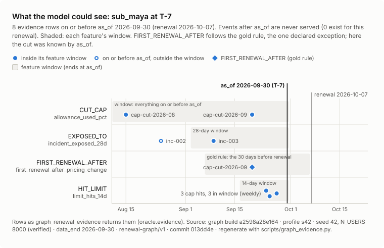
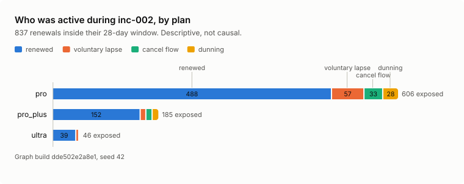

# Graph on gold: what it shows, and what it does not

Every chart, and every table inside a generated region (between `graph-evidence` markers), is generated
from one graph build and the results files by `scripts/graph_charts.py` (through
`scripts/graph_evidence.py`). Everything else is typed by hand and says where it comes from. The explain
shares, the narrower cells and the named-cohort counts were computed on this build (the explain shares are
re-derived in [graph-tools-s42.md](results/graph-tools-s42.md), the cohorts are listed in
[cohorts.md](results/cohorts.md)). The unweighted Louvain / Leiden row, the odds ratios, the AUC table,
the leakage figures and the old-model eval are planning-prototype measurements that no repo script
reproduces yet. Build: seed 42, `N_USERS=8000`, profile s42, graph build `28f3af496493`, macOS arm64.
The data is synthetic, and subscriptions have no relationships to each other.

## Checks of record

The latest run of every check, with its command and output: [results/index.md](results/index.md).

<!-- graph-evidence:begin results:checks -->
| Check | Profile | Status | Result | Summary |
|---|---|---|---|---|
| Graph contract (tiny) | tiny | pass | [graph-contract-tiny.md](results/graph-contract-tiny.md) | Graph contract OK (renewal-graph/v1, profile tiny, build 10ea18b83bbc): 616 nodes / 1,949 edges; PIT parity 0 mismatches x 6 features in pandas and Cypher; naive wrong in 16 / 12 / 4 renewals; golden tiny; strict |
| Graph contract (s42) | s42 | pass | [graph-contract-s42.md](results/graph-contract-s42.md) | Graph contract OK (renewal-graph/v1, profile s42, build 28f3af496493): 40,204 nodes / 130,366 edges; PIT parity 0 mismatches x 6 features in pandas and Cypher; naive wrong in 1,165 / 681 / 114 renewals; golden s42; strict |
| Graph contract (default) | default | pass | [graph-contract-default.md](results/graph-contract-default.md) | Graph contract OK (renewal-graph/v1, profile default, build 28f3af496493): 40,204 nodes / 130,366 edges; PIT parity 0 mismatches x 6 features in pandas and Cypher; naive wrong in 1,165 / 681 / 114 renewals; golden s42; strict |
| Graph contract (Iceberg-sourced build) | - | not available | [graph-contract-iceberg.md](results/graph-contract-iceberg.md) | No Iceberg-sourced build in this GRAPH_ROOT. The Docker path builds one (pipelines/run_graph_e2e.sh); its recorded result is in docker-e2e.md. |
| Lineage contract (core profile) | default | **FAIL** | [lineage-contract.md](results/lineage-contract.md) | Lineage contract FAILED: unresolved name: .github/workflows/ci.yml:55: runs scripts/sync_lakehouse_exports.sh, which does not exist |
| Repo contracts (Tier-0 mini) | - | pass | [repo-contracts.md](results/repo-contracts.md) | Repo contracts OK: 0 errors, 2 warnings |
| Agent tools check (tiny) | tiny | pass | [graph-tools-tiny.md](results/graph-tools-tiny.md) | check_graph_tools: OK (58/58 checks, 0 warning(s), 12.5 s) |
| Agent tools check (s42) | s42 | pass | [graph-tools-s42.md](results/graph-tools-s42.md), [tools-bench-s42.json](results/tools-bench-s42.json) | check_graph_tools: OK (94/94 checks, 0 warning(s), 196.7 s) |
| macOS sandbox check | - | pass | [sandbox-check.md](results/sandbox-check.md) | graph_sandbox_check: OK (47/47 checks passed) |
| Spark SQL twin parity (tiny) | tiny | pass | [graph-parity-tiny.md](results/graph-parity-tiny.md) | Graph parity OK (similar_to/renewal-v1): 21 tables equal and SIMILAR_TO 1,182 edges identical with the persisted scaler on the same input; reported configurations tie-only; 25.75 s |
| Spark SQL twin parity (s42) | s42 | pass | [graph-parity-s42.md](results/graph-parity-s42.md) | Graph parity OK (similar_to/renewal-v1): 21 tables equal and SIMILAR_TO 80,010 edges identical with the persisted scaler on the same input; reported configurations tie-only; 71.73 s |
| Feature cohorts (s42) | s42 | pass | [cohorts.md](results/cohorts.md) | outside the graph contract; 15 leiden cohorts (modularity 0.805592, seed 42, networkx 3.7); 15 louvain cohorts (modularity 0.806498, seed 42, networkx 3.7) |
| Build and serve benchmark | - | not available | [bench.md](results/bench.md) | scripts/graph_bench.py (PHASE 3a) is not in this checkout yet. Measured figures today: the builder and loader RSS in each graph contract (Resources section) and the per-tool warm p50 / p95 in graph-tools-s42.md. |
| Agent eval report | - | not available | [eval.md](results/eval.md) | No eval report yet: the eval harness (scripts/graph_eval.py, evals/graph_cases.yaml, PHASE 3a) is not in this checkout. LLM results gate article claims, never merges. |
| Leakage demo (AUCs) | - | not available | [leakage.md](results/leakage.md) | scripts/graph_leakage_demo.py (PHASE 3a) is not in this checkout yet; the planning prototype's figures are quoted in docs/graph/evaluation.md and marked as such. |
| Docker end-to-end run (recorded) | - | partial | [docker-e2e.md](results/docker-e2e.md) | recorded run; step(s) failed: A_graph_e2e_head |
| Tool catalogue | - | pass | [tool-catalogue.md](results/tool-catalogue.md) | 14 tools in 4 toolsets |
<!-- graph-evidence:end results:checks -->

## One renewal at T-7

The hero is `sub_maya:2026-10-07`: plan pro, renewing seven days after the data ends, scored "today"
(route `score_today`). Her T-7 is 2026-09-30. `graph_renewal_evidence` returns what the model could see
then, and nothing after it:

<!-- graph-evidence:begin figure:maya-timeline -->
<picture>
  <source media="(prefers-color-scheme: dark)" srcset="img/maya-timeline-dark.svg">
  
</picture>

| event_date | relation | target | feeds feature | in feature window | known by as_of | declared exception |
|---|---|---|---|---|---|---|
| 2026-08-15 | CUT_CAP | cap-cut-2026-08 | allowance_used_pct | yes | yes | no |
| 2026-08-25 | EXPOSED_TO | inc-002 | incident_exposed_28d | no | yes | no |
| 2026-09-09 | EXPOSED_TO | inc-003 | incident_exposed_28d | yes | yes | no |
| 2026-09-20 | CUT_CAP | cap-cut-2026-09 | allowance_used_pct | yes | yes | no |
| 2026-09-20 | FIRST_RENEWAL_AFTER | cap-cut-2026-09 | first_renewal_after_pricing_change | yes | yes | no |
| 2026-09-24 | HIT_LIMIT | lh:sub_maya:001 | limit_hits_14d | yes | yes | no |
| 2026-09-25 | HIT_LIMIT | lh:sub_maya:002 | limit_hits_14d | yes | yes | no |
| 2026-09-27 | HIT_LIMIT | lh:sub_maya:003 | limit_hits_14d | yes | yes | no |

Rows as graph_renewal_evidence returns them (oracle.evidence). Source: graph build 28f3af496493 · profile s42 · seed 42, N_USERS 8000 (verified) · data_end 2026-09-30 · renewal-graph/v1 · commit d317368 (dirty) · regenerate with scripts/graph_evidence.py.
<!-- graph-evidence:end figure:maya-timeline -->

`graph_similar_renewals` shows the ten closest past renewals of the same plan in feature space, with
their outcomes. For a current renewal like hers every neighbour outcome is visible; a historical source
would only see outcomes observed by its own as_of.

<!-- graph-evidence:begin figure:maya-neighbours -->
<picture>
  <source media="(prefers-color-scheme: dark)" srcset="img/maya-neighbours-dark.svg">
  
</picture>

| rank | renewal | dist | d2_q | outcome |
|---:|---|---:|---:|---|
| 1 | sub_07200:2026-08-17 | 2.2581 | 5,099,099,315 | voluntary_lapse |
| 2 | sub_06614:2026-08-21 | 2.3650 | 5,593,304,415 | renewed |
| 3 | sub_01541:2026-08-16 | 2.3700 | 5,616,850,275 | renewed |
| 4 | sub_04760:2026-09-09 | 2.5101 | 6,300,541,441 | renewed |
| 5 | sub_01355:2026-09-05 | 2.5699 | 6,604,184,020 | voluntary_lapse |
| 6 | sub_05564:2026-08-20 | 2.6926 | 7,250,182,869 | renewed |
| 7 | sub_01475:2026-08-19 | 2.7135 | 7,362,875,678 | renewed |
| 8 | sub_04856:2026-08-22 | 2.7150 | 7,371,318,997 | renewed |
| 9 | sub_01888:2026-08-23 | 2.7398 | 7,506,448,249 | renewed |
| 10 | sub_00228:2026-08-03 | 2.7773 | 7,713,654,324 | renewed |
|  | summary |  |  | 2 of 10 lapsed, Wilson 95% [0.057, 0.510] |

SIMILAR_TO spec similar_to/renewal-v1: blocked by plan, 20 features, persisted z-score scaler, rank on floor(d2*1e9 + 0.5) then dst. Source: graph build 28f3af496493 · profile s42 · seed 42, N_USERS 8000 (verified) · data_end 2026-09-30 · renewal-graph/v1 · commit d317368 (dirty) · regenerate with scripts/graph_evidence.py.
<!-- graph-evidence:end figure:maya-neighbours -->

Why is `sub_07200` the closest? With `explain=true` the tool returns each pair's top feature shares of
the squared distance: `cheap_model_share_28d` 0.408, `engagement_trend` 0.123, `weekend_usage_ratio`
0.118 (pair d2 5.0991). This is narrative evidence: it says which past renewals look like hers, not that
she will lapse. Her own risk score comes from the retention-radar model, not from any tool here.

## A global event

`graph_exposure(entity_id="inc-002")` counts who was active during an incident inside their own feature
window, with the same as-of discipline:

<!-- graph-evidence:begin figure:inc-002-exposure -->
<picture>
  <source media="(prefers-color-scheme: dark)" srcset="img/inc-002-exposure-dark.svg">
  
</picture>

| plan | exposed | renewed | voluntary lapse | cancel flow | dunning |
|---|---:|---:|---:|---:|---:|
| pro | 606 | 488 | 57 | 33 | 28 |
| pro_plus | 185 | 152 | 10 | 11 | 12 |
| ultra | 46 | 39 | 5 | 0 | 2 |
| total | 837 | 679 | 72 | 44 | 42 |
| a graph without the as_of bound would add | 329 |  |  |  |  |

Exposed = an active usage day during the incident inside (as_of-28, as_of]; renewed and voluntary lapse are model-routed renewals. Source: graph build 28f3af496493 · profile s42 · seed 42, N_USERS 8000 (verified) · data_end 2026-09-30 · renewal-graph/v1 · commit d317368 (dirty) · regenerate with scripts/graph_evidence.py.
<!-- graph-evidence:end figure:inc-002-exposure -->

The counts are graph-shaped; the effect is not reliable. Activity-stratified odds ratios measured in the
planning analysis were 1.12 (inc-001) and 1.04 (inc-002) with overlapping intervals, and inc-003 touched
25 renewals with 0 lapses. No tool computes an odds ratio, so the tools say "descriptive, not causal".

## Population rates

Rates are metric questions, answered by `metric_lapse_rate` with n and a Wilson interval:

<!-- graph-evidence:begin figure:lapse-first-after-cut -->
<picture>
  <source media="(prefers-color-scheme: dark)" srcset="img/lapse-first-after-cut-dark.svg">
  
</picture>

| group | renewals | n | lapses | rate | Wilson 95% |
|---|---|---:|---:|---:|---|
| all plans | not first after a cut | 5,095 | 321 | 6.3% | [5.7%, 7.0%] |
| all plans | first after a cut | 2,292 | 227 | 9.9% | [8.8%, 11.2%] |
| pro | not first after a cut | 4,016 | 275 | 6.8% | [6.1%, 7.7%] |
| pro | first after a cut | 1,799 | 189 | 10.5% | [9.2%, 12.0%] |
| pro_plus | not first after a cut | 871 | 43 | 4.9% | [3.7%, 6.6%] |
| pro_plus | first after a cut | 387 | 30 | 7.8% | [5.5%, 10.8%] |
| ultra | not first after a cut | 208 | 3 | 1.4% | [0.5%, 4.2%] |
| ultra | first after a cut | 106 | 8 | 7.5% | [3.9%, 14.2%] |

First renewal after a cap cut = a FIRST_RENEWAL_AFTER edge (the gold rule). Same population as metric_lapse_rate (route = model). Source: graph build 28f3af496493 · profile s42 · seed 42, N_USERS 8000 (verified) · data_end 2026-09-30 · renewal-graph/v1 · commit d317368 (dirty) · regenerate with scripts/graph_evidence.py.
<!-- graph-evidence:end figure:lapse-first-after-cut -->

The association between a cap cut and lapsing exists because the generator plants it. Narrower cells:
pro renewals with 3 to 5 cap hits that were the first after a cut lapsed 29 of 72 times (40.3%,
[29.7%, 51.8%]). The motif "cap hit, then overage switched off, both on or before as_of" covers 238 model
renewals with 39 lapses (16.4%); its order carries no information (the reverse order occurs 3 times).

## Feature cohorts

Louvain and Leiden (NetworkX 3.7, seed 42, resolution 1.0) over the undirected SIMILAR_TO graph of the
7,387 model renewals, weight `1 / (1 + dist)`; the 614 other renewals take their rank-1 neighbour's
cohort. Cohorts sit outside the graph contract ([results/cohorts.md](results/cohorts.md)).

<!-- graph-evidence:begin figure:cohort-lapse-rates -->
<picture>
  <source media="(prefers-color-scheme: dark)" srcset="img/cohort-lapse-rates-dark.svg">
  
</picture>

| cohort | plan | n | lapses | rate | Wilson 95% | name |
|---|---|---:|---:|---:|---|---|
| leiden-14 | pro | 94 | 30 | 31.9% | [23.4%, 41.9%] | higher limit_hits_14d, higher allowance_used_pct |
| leiden-11 | pro | 143 | 30 | 21.0% | [15.1%, 28.4%] | higher overage_toggled_off, higher allowance_used_pct |
| leiden-15 | pro | 55 | 9 | 16.4% | [8.9%, 28.3%] | higher last_active_days_ago, lower agent_task_success_rate |
| leiden-13 | pro | 94 | 13 | 13.8% | [8.3%, 22.2%] | higher last_active_days_ago, lower agent_task_success_rate |
| leiden-12 | pro_plus | 108 | 11 | 10.2% | [5.8%, 17.3%] | higher overage_toggled_off, higher overage_usd_28d |
| leiden-02 | pro | 833 | 76 | 9.1% | [7.3%, 11.3%] | higher first_renewal_after_pricing_change, higher incident_exposed_28d |
| leiden-04 | pro | 734 | 64 | 8.7% | [6.9%, 11.0%] | lower engagement_trend, lower active_days_7d |
| leiden-05 | pro | 734 | 60 | 8.2% | [6.4%, 10.4%] | higher incident_exposed_28d, lower first_renewal_after_pricing_change |
| leiden-03 | pro | 778 | 58 | 7.5% | [5.8%, 9.5%] | higher first_renewal_after_pricing_change, lower incident_exposed_28d |
| leiden-09 | pro | 435 | 32 | 7.4% | [5.3%, 10.2%] | higher weekend_usage_ratio, lower incident_exposed_28d |
| leiden-08 | pro | 538 | 35 | 6.5% | [4.7%, 8.9%] | higher support_tickets_90d, lower incident_exposed_28d |
| leiden-01 | pro_plus | 1,150 | 62 | 5.4% | [4.2%, 6.9%] | higher active_days_28d, higher allowance_used_pct |
| leiden-06 | pro | 712 | 33 | 4.6% | [3.3%, 6.4%] | lower active_days_28d, lower incident_exposed_28d |
| leiden-07 | pro | 665 | 24 | 3.6% | [2.4%, 5.3%] | lower incident_exposed_28d, higher active_days_7d |
| leiden-10 | ultra | 314 | 11 | 3.5% | [2.0%, 6.2%] | higher active_days_28d, higher ide_sessions_28d |

cohort_list (cohorts/renewal-v1, seed 42); outside the graph contract; cells under 5 and their complements are withheld. Source: graph build 28f3af496493 · profile s42 · seed 42, N_USERS 8000 (verified) · data_end 2026-09-30 · renewal-graph/v1 · commit d317368 (dirty) · regenerate with scripts/graph_evidence.py.
<!-- graph-evidence:end figure:cohort-lapse-rates -->

| | Louvain | Leiden |
|---|---|---|
| weighted (the spec) | 15 cohorts, modularity 0.8065 | 15 cohorts, modularity 0.8056 |
| unweighted (the planning analysis) | 15 cohorts, modularity 0.8072 | 14 cohorts, modularity 0.8020 |

Plan purity is 1.0 by construction (SIMILAR_TO is blocked by plan). The named cohorts of the planning
analysis come back: overage switched off, pro, 30 of 143 lapsed (21.0%) in both algorithms; cap pressure,
pro, 36 of 152 (23.7%) in Louvain against the plan's 24.5% (measured unweighted) and 30 of 94 in Leiden.
Cohorts rediscover the generator's feature segments: they are labels, not structure.

## What the graph does not add

No predictive lift is claimed. These figures come from the planning analysis on the same seed and data
(prototype scripts, not yet reproduced by a repo script):

| Model | AUC |
|---|---:|
| logistic regression on the gold features (baseline) | 0.7198 |
| + neighbour lapse rate, temporally safe (outcomes observed by each source's as_of) | 0.7198 |
| + the same rate over a random graph | 0.7197 |
| + neighbour lapse rate as of today (outcomes after T-7 leak in) | 0.7223 |
| gradient boosting without / with the neighbour rate | 0.7209 / 0.7203 |

The small gain only appears when neighbour outcomes from after T-7 are allowed. That is the lesson the
leakage demo makes visible: on a dataset with **zero** network effect, a self-inclusive neighbour rate
reaches a single-feature AUC of 0.8525 (logistic regression 0.8655), the as-of-today rate 0.6158, and the
temporally safe rate 0.5487.

<!-- graph-evidence:begin figure:leakage-aucs -->
> **Pending final run.** The leakage demo AUCs have not been reproduced by a repo script yet: scripts/graph_leakage_demo.py (PHASE 3a) is not in this checkout. The planning prototype's figures are quoted in the text above, marked as such.
<!-- graph-evidence:end figure:leakage-aucs -->

Other things the graph does not do: no PageRank, node2vec or graph neural network on a kNN graph
(PageRank there is in-degree in disguise, Spearman 0.90); no "contagion" story; no LLM extraction in the
build path; no GraphRAG framework.

## Agent eval

Designed, **not run**: the harness (`scripts/graph_eval.py`, `evals/graph_cases.yaml`, recorded traces
under `evals/replay/`) is not in this checkout. The design:

- 40 cases (evidence 5, similarity 5, exposure 3, entity resolution 3, lapse rates 6, feature cards 3,
  lineage 6, multi-step 2, honesty / refusal / injection 7), each with an oracle reference recomputed per
  seed instead of a literal answer; seeds 42 and 7; 3 trials per case at temperature 0.7 with a distinct
  seed per trial; pass^3 by question shape.
- Four arms: R (router + one small toolset), H (every typed tool, unrouted: 12 in the plan, 14 now that
  the two cohort tools exist; it decides whether the router stays), M (metrics only) and SE (the same precomputed tables behind one read-only SQL tool on
  in-memory DuckDB, eval-only: is the value in typed tools or in the data?).
- Code graders only: exact match, set F1 for id lists, numeric tolerance, required caveats ("not a risk
  estimate", n and interval), forbidden claims, the expected toolset, at most 6 tool calls.
- Gates decide what the article may claim, never what merges: an open model is "supported" at ≥80%
  pass^3 on graph and lineage shapes, ≥60% on metric shapes, <2% text tool calls, p95 <10 s, otherwise
  "experimental" with its numbers; the Claude arm needs 100% pass^3 on the 7 honesty cases. The merge
  gate is a deterministic replay of recorded traces.

<!-- graph-evidence:begin figure:eval-pass3 -->
> **Pending final run.** The agent eval (pass^3 by arm and question shape) has not run yet: the eval harness (scripts/graph_eval.py, PHASE 3a) is not in this checkout. When it exists, `scripts/graph_evidence.py` records it and fills this chart.
<!-- graph-evidence:end figure:eval-pass3 -->

Earlier evidence, on the **old** churn model (users / usage / tickets, 5,000 users) with `llama3.2:3b`,
480 episodes: curated graph tools passed 17 of 40 cases on all three trials (15 of 22 graph-shaped);
text-to-SQL passed 0 of 40; a SQL arm given the same precomputed edges, communities and lineage as
tables passed 1 of 40 (0 of 22 graph-shaped); mixing 5 SQL tools with 6 graph tools dropped graph-shaped
pass^3 to 9 of 22. That pointed at narrow typed tools over precomputed structures as the value, not the
graph engine. It has to be re-measured on the new model before anything is claimed.

## Honesty notes

1. The data is synthetic and has no relationship between subscriptions. Similar is not connected.
2. "2 of her 10 nearest renewals lapsed" is narrative evidence (Wilson 6% to 51%), not a risk estimate.
3. Incident exposure shows no reliable effect; the pricing-cut association is planted by the generator.
4. The point-in-time leak is real and measurable: a naive graph gets 1,165 limit-hit counts, 681 incident
   flags and 114 ticket counts wrong and calls 329 extra renewals exposed to inc-002.
5. Latency and memory come from one M1 Pro under swap pressure: indicative only. No Linux figures exist
   until the first CI run.
6. The lift and leakage figures above come from planning prototypes and are reported, never pinned.
