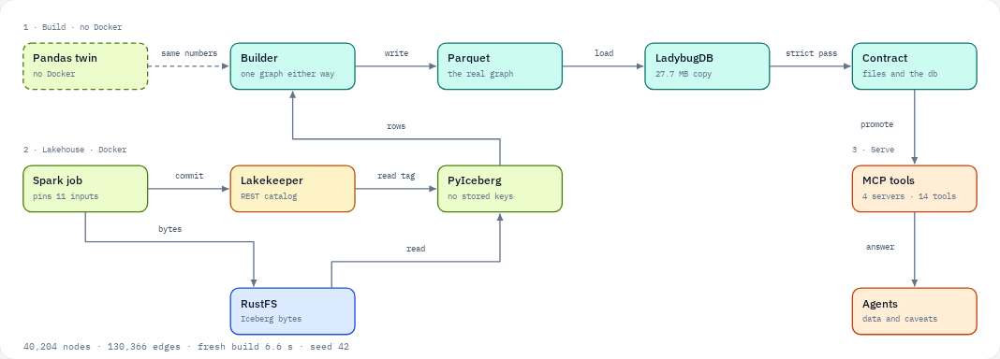
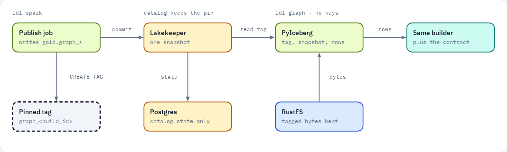
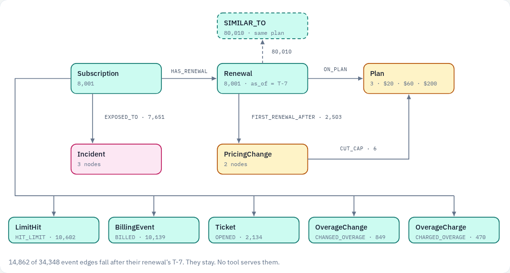
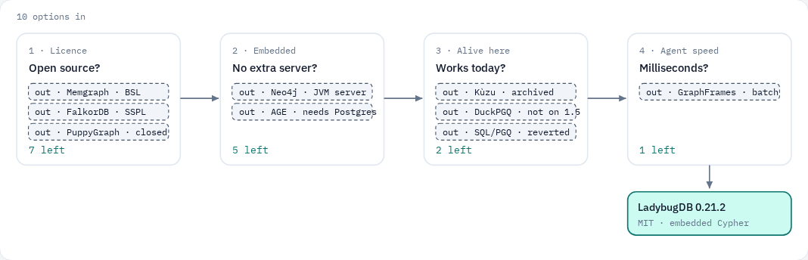
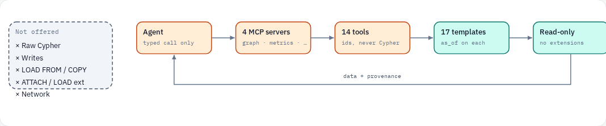

# Graph figures

Five drawings of the graph on gold, in the same palette as [diagrams.md](../diagrams.md). They read left to right. The pandas twin is attached to the builder, the denied list is a wall, and the engine filter is one row. Tap through the same pictures in the [gold graph atlas](https://grok.com/preview/84d2d56a-e013-4c9a-8a97-1b1eda6d44b5).

Counts are seed 42: 40,204 nodes, 130,366 edges.

## System

Gold in, a graph out. The dashed pandas twin joins the builder with the same numbers. Spark commits through Lakekeeper and writes bytes to RustFS. PyIceberg reads the tag, then those bytes, and holds no keys. Parquet is the graph. LadybugDB is the copy. A strict pass promotes it to the tools.

## Iceberg tags

Read the tag, not the clock. The publish job writes `gold.graph_*` and creates `graph_<build_id>`. Lakekeeper keeps that pin. Postgres holds catalog state and does not feed the files. PyIceberg reads the tag, then the bytes on RustFS, and runs the same builder.

## Schema

Ten node types and eleven dated edges. Arrows leave the source: Subscription to its events, its renewal and its incidents; Renewal to Plan, to PricingChange, and to other renewals on the same plan. `SIMILAR_TO` is similar features, not a social graph. 14,862 of 34,348 event edges fall after their renewal’s T-7. They stay in the graph. No tool serves them for that decision.

## Engine

Ten options, four questions, one engine left. Licence, then embedded in Python, then usable on this stack today, then millisecond queries. GraphFrames stays for batch. LadybugDB 0.21.2 is what remains.

## Agent boundary

The agent never touches the engine. Raw Cypher, writes, `LOAD FROM`, `COPY TO`, `ATTACH`, extensions and the network are not offered. Fourteen typed tools call seventeen templates. Every template carries the `as_of` bound. The answer comes back with data, provenance and caveats.

