# Graph on gold: the lineage graph

A second, small graph about the pipeline itself: which column feeds which, through which window,
checked by which assertion, run by which job, DAG task, Make target or CI step. It is extracted from the
repo's own code, offline, in about 3 seconds, and served by the `lakehouse-lineage` MCP toolset. Spec
`metadata-graph/0.1` (`src/lakehouse_graph/lineage/spec.py`). Contract:
`scripts/check_lineage_contract.py --strict` ([results/lineage-contract.md](results/lineage-contract.md)).

Nothing else in the lakehouse holds this information today, and building it found real defects
([findings](#findings)).

## Tiers

| Tier | Source | Needs | Status |
|---|---|---|---|
| 0 | sqlglot 30.21 (qualify + a scope walk) over `sql/churn/gold_renewal_features.sql` and `sql/retail/*.sql`; Python `ast` over the Spark jobs, scripts and DAGs; the Makefile, shell pipelines, CI workflow and README numbers; contract constants imported from the check scripts | nothing (offline) | built: `scripts/build_lineage_local.py` (`make lineage-local`, [operations.md](operations.md#make-targets)) |
| 1 | PyIceberg `.snapshots` and `.refs` (never `.history`, which expiry trims): Snapshot / Ref nodes, HAS_SNAPSHOT / POINTS_TO / SUPERSEDES / CONSUMED_SNAPSHOT edges | the Docker lakehouse (REST catalog) | built: `src/lakehouse_graph/lineage/iceberg_facts.py`, `build_lineage_local.py --iceberg`; ran through Lakekeeper in the 2026-10-02 Docker run |
| 2 | OpenLineage (`openlineage-spark_2.13` 1.53.0, file transport) | Docker, opt-in `OPENLINEAGE=1` | measured on the earlier JDBC catalog: the Spark job emitted runs, parents and timing but no Iceberg datasets (OpenLineage issue #4677); not re-run on the REST catalog; no loader into the graph yet |

## What is in it

24 node labels and 47 edge types (6 edge types and 3 labels are Tier-1 placeholders). The core profile
of build `28f3af496493` (56 files read) has 612 nodes and 1,713 edges;
those totals move with every script or DAG added to the repo and are reported, not gated.

| Kind | Labels (count in this build) |
|---|---|
| data | DataColumn 322, Dataset 69, Cte 15, Window 9, Export 3, SqlFile 7, Metric 8, Parameter 6, PointInTimeRule 2, GraphElement 21 |
| code and orchestration | Job 26, ShellScript 10, MakeTarget 23, Dag 3, DagTask 16, CiStep 4, EnvVar 12 |
| checks | Contract 9, Assertion 47 |
| consumers and snapshots | DownstreamRepo 0, FileSnapshot 0 (core profile), Snapshot / Ref / Run 0 (Tier 1) |

`DataColumn` is called that because `Column` is a reserved word in Ladybug Cypher. The main edge,
`DERIVED_FROM` (346), carries a role (VALUE, FILTER, JOIN_KEY, WINDOW_BOUND, ANCHOR), the CTE, and the
window relative to as_of. `COUNTS_ROWS_OF` (4) fills sqlglot's `COUNT(*)` gap for `renewals_completed`,
`limit_hits_14d` and `support_tickets_90d`. The 21 `GraphElement` nodes bridge to the business graph:
every node label and edge type of [data-model.md](data-model.md) is `SOURCED_FROM` its silver or gold
dataset and columns.

## One column, end to end

The upstream lineage of `gold.churn_renewal_features.limit_hits_14d`, generated from the lineage Parquet:

```mermaid
%%{init: {"theme": "base", "flowchart": {"wrappingWidth": 360}, "themeVariables": {"primaryColor": "#CCFBF1", "primaryTextColor": "#0F172A", "primaryBorderColor": "#0F766E", "lineColor": "#64748B", "textColor": "#0F172A", "edgeLabelBackground": "#FFFFFF", "clusterBkg": "#FFFFFF", "clusterBorder": "#64748B", "titleColor": "#0F172A", "attributeBackgroundColorOdd": "#FFFFFF", "attributeBackgroundColorEven": "#F0FDFA", "relationColor": "#64748B", "relationLabelBackground": "#FFFFFF", "relationLabelColor": "#0F172A"}}}%%
flowchart LR
  subgraph source["source"]
    n8["limit_events.hit_at"]
    n9["limit_events.subscription_id"]
    n10["subscription_snapshots.snapshot_date"]
  end
  subgraph bronze["bronze"]
    n0["churn_limit_events_raw.hit_at"]
    n1["churn_limit_events_raw.subscription_id"]
    n2["churn_subscription_snapshots_raw.snapshot_date"]
  end
  subgraph silver["silver"]
    n4["churn_limit_events (table)"]
    n5["churn_limit_events.hit_date"]
    n6["churn_limit_events.subscription_id"]
    n7["churn_subscription_snapshots.snapshot_date"]
  end
  subgraph gold["gold"]
    n3["churn_renewal_features.limit_hits_14d"]
  end
  n4 -->|"COUNTS_ROWS_OF (as_of-14, as_of]"| n3
  n5 -->|"WINDOW_BOUND (as_of-14, as_of]"| n3
  n6 -->|"JOIN_KEY (as_of-14, as_of]"| n3
  n7 -->|"ANCHOR as as_of"| n3
  n0 -->|"VALUE F.to_date('hit_at')"| n5
  n1 -->|"VALUE"| n6
  n2 -->|"VALUE"| n7
  n8 -->|"VALUE CAST(TIMESTAMP)"| n0
  n9 -->|"VALUE CAST(STRING)"| n1
  n10 -->|"VALUE CAST(DATE)"| n2

  classDef storage fill:#DBEAFE,stroke:#1D4ED8,color:#0F172A,stroke-width:1.5px
  classDef catalog fill:#FEF3C7,stroke:#B45309,color:#0F172A,stroke-width:1.5px
  classDef compute fill:#ECFCCB,stroke:#4D7C0F,color:#0F172A,stroke-width:1.5px
  classDef orchestration fill:#FCE7F3,stroke:#BE185D,color:#0F172A,stroke-width:1.5px
  classDef graphlayer fill:#CCFBF1,stroke:#0F766E,color:#0F172A,stroke-width:1.5px
  classDef consumer fill:#FFEDD5,stroke:#C2410C,color:#0F172A,stroke-width:1.5px
  classDef data fill:#F1F5F9,stroke:#475569,color:#0F172A,stroke-width:1.5px
  class n0,n1,n2,n3,n4,n5,n6,n7,n8,n9,n10 data
```

<!-- graph-evidence:begin mermaid:lineage-limit-hits-14d -->

Generated from the lineage Parquet of build dde502e2a8e1 (lineage build 3999f2dea0cb, core profile) by the pure-Python oracle: 10 edges, 9 columns.
<!-- graph-evidence:end mermaid:lineage-limit-hits-14d -->

The point-in-time window `(as_of-14, as_of]` sits on the gold read of `silver.churn_limit_events.hit_date`.
Silver `hit_at` is an identity copy that gold never reads: asking what breaks downstream of **silver**
`hit_at` correctly returns no gold column, while **bronze** `hit_at` reaches gold only through silver
`hit_date` (contract invariant 9). The same trace can be drawn as a standalone HTML page:
`scripts/graph_viz.py --lineage gold.churn_renewal_features.limit_hits_14d`.

## The lineage tools

| Tool | Arguments | Returns |
|---|---|---|
| `lineage_trace` | `target` (a ColumnRef `layer.table.column`, layer in source / bronze / silver / gold / export), `direction` upstream or downstream, `max_depth` 1 to 6 | edges `{depth, rel, from, to, roles, cte, window, transform}` by depth, plus the columns, datasets, assertions, contracts and consumers reached |
| `lineage_pit` | `feature` (one of the 22) or none | per feature: PIT status, upper bound relative to as_of, windows, declared-leaky; none lists every exception |
| `lineage_guards` | `column` or none | the assertions that check a column (contract, kind, severity, bounds, source line); none lists the gold columns no executed check looks at |
| `lineage_unused` | `layer` bronze or silver, `domain` churn or retail | columns the next layer never reads as a value or in a predicate |

Junk values (`""`, `"null"`, `"None"`, null) take the defaults. A check on a bronze or silver column
adds a caveat pointing to `lineage_trace(..., direction="downstream")`, because checks attach to export
and gold columns.

Latency, read-only with a 128 MB pool: warm medians about 1 to 3 ms per question; the first call on a
fresh connection is slower (about 50 to 60 ms to open, then up to about 25 to 30 ms for the first
question). The 10 ms target applies to warm calls.

## The contract

`scripts/check_lineage_contract.py` computes every answer twice, in Cypher on `lineage.lbdb` and with a
pure-Python breadth-first walk over the Parquet (`lineage/oracle.py`), requires them to be equal, and
compares them with the committed golden `src/lakehouse_graph/lineage/goldens/core.json`:

- all 30 gold SQL output columns resolve to source columns or row counts (137 DERIVED_FROM + 3
  COUNTS_ROWS_OF edges in the churn gold);
- 20 of 22 features are point-in-time compliant; the two declared exceptions are `renewals_completed`
  (its invoice read is bounded by renewal_date, as_of + 7; 0 rows fall in that gap at seed 42) and
  `first_renewal_after_pricing_change` (the gold rule; 495 flagged edges);
- the 9 silver churn columns gold never reads (for example `invoices.amount_usd`,
  `limit_events.limit_type`, silver `hit_at`);
- the 4 gold columns no value check looks at: `city`, `feature_as_of`, `renewal_date`, `built_at`;
- 6 of the 18 contract ranges are guaranteed by the SQL itself (4 clamps and 2 window lengths);
- parameters (plan allowances 550 / 1,650 / 11,000, the 0.83 cap cut, T-7) agree across the gold SQL, the
  pandas twin and the generator;
- invariant 9 (above).

Every name the extractor cannot resolve is an error: a pipeline it cannot read never passes silently.

### What the scope walk supports

`sqlglot.lineage()` gives projection lineage only. The scope walk in
`src/lakehouse_graph/lineage/scope_walk.py` also reads the predicates that decide *which rows* a feature
reads. A time bound is a top-level AND conjunct `<column> <op> <anchor ± N days>` in a WHERE or in the
ON of a join that does not preserve the table's rows, or in the single WHEN of an aggregate over
`CASE WHEN`; nothing under OR or NOT is a bound. Bounds are pushed through a plain row filter (a CTE or
derived table that is `SELECT ... FROM <one table> [WHERE ...]`). The renewals CTE must itself be a plain
row filter. Constructs the walk does not model stop the extraction instead of being skipped: UNION,
LATERAL VIEW, PIVOT, TABLESAMPLE, time travel, nested WITH, subqueries in conditions, and anything that
leaves the renewal grain (self joins, grouping without the subscription key, LIMIT / OFFSET, DISTINCT
without the key, window functions not partitioned by it). Safe SQL that the walk cannot prove bounded is
reported as an undeclared exception, with the remedy: join the base table in the feature CTE and write
the bounds as top-level AND conditions. The module docstring is the full rule set.

### Twins and the Spark job

The Spark graph job publishes two union tables, `gold.graph_nodes` (partitioned by `label`) and
`gold.graph_edges` (partitioned by `rel_type`), plus `graph_similar_to_scaler` and the append-only
`graph_build_manifest`. The lineage records each Parquet table as `MIRRORS` the union twin with its
partition (`label = 'Renewal'`), a `PARITY_TWIN_OF` edge from `scripts/build_graph_local.py` to the Spark
job (checked by `scripts/check_graph_parity.py`), and `EXECUTES_SQL` edges to `sql/graph/*.sql`.

## Findings

What building the lineage graph found in the repo (at `3efe31a`, still true at `d317368`):

1. `scripts/check_churn_export.py` lists `cancel_at_period_end` as LEAKY, a column no churn dataset has
   (`check_repo_contracts.py` warns).
2. Four gold columns have no value check (above). Parity coverage of `check_gold_parity.py` does not
   compare `city`, `feature_as_of` or `renewal_date` either.
3. The lakehouse range checks warn where retention-radar's error (visible with a local radar checkout,
   `RADAR_DIR`, full profile).
4. Nine silver churn columns are never read by gold.
5. `DUNNING_DAYS = 14` is defined and never read.
6. `config/catalog.md` still lists the old churn tables.
7. `src/jobs/retail/05_query_timetravel.py` sets appName `05_query_and_timetravel` (job-name drift;
   `check_repo_contracts.py` warns).

## Known issue: the CI clone line

**Resolved on `feat/local-first-stack-2026`; kept here because other pages link to it.** Commit `d317368`
("ci: consume the same-named retention-radar branch when it exists") moved the retention-radar URL into
a shell variable (`git clone --depth 1 --branch "$REF" "$URL" ...`). The extractor only recognises a
literal `https://github.com/...` URL on the clone line, so it reported `.github/workflows/ci.yml:55: runs
scripts/sync_lakehouse_exports.sh, which does not exist`, lost the retention-radar consumer
(`DownstreamRepo` 0 instead of 1) and failed the strict lineage contract, `pipelines/run_graph_e2e.sh`
and the `lakehouse_graph` DAG at their lineage step.

On this branch the clone stays in the CI step, the radar consumer is `pipelines/radar_consume.sh` (it calls
retention-radar's own Python sync), and the bronze ingest reads literal paths, so the strict lineage
contract passes again and the golden `core.json` matches. The record in
[results/lineage-contract.md](results/lineage-contract.md) is the passing 2026-10-02 run. A `$VAR` / `${VAR}` resolver in `src/lakehouse_graph/lineage/extract.py` is still not built,
so moving the URL back into a variable would break the contract again.

## Honesty notes

- Tier-0 lineage is code-derived: it says what the code reads and writes, not which rows a run touched.
- The walk is deliberately conservative; it never guesses a bound.
- The node and edge totals change with every file added to the repo. Only the semantic answers are
  pinned by the golden.
